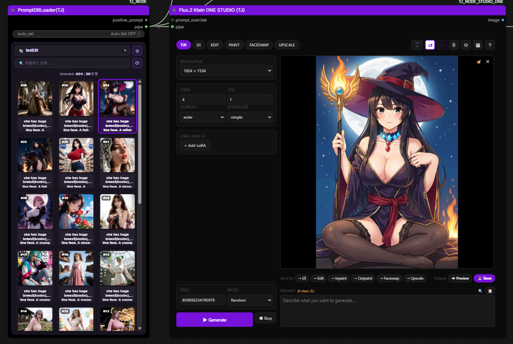
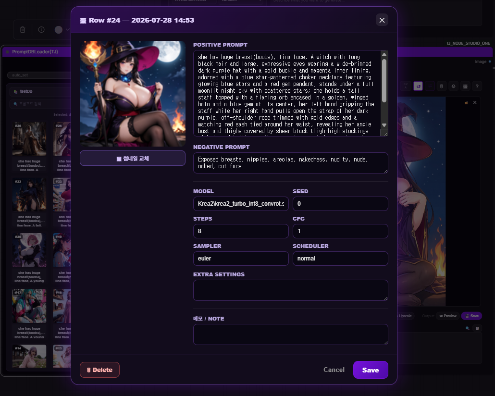

# TJ NODE STUDIO ONE (통합 패키지)
# TJ NODE STUDIO ONE (Integrated Package)

> **ComfyUI 올인원 이미지 생성 UI 패키지** — Z-Image ONE STUDIO, Flux.2 Klein ONE STUDIO, Qwen Image Edit 2511 ONE STUDIO, Krea 2 ONE STUDIO, **SDXL ONE STUDIO**, Minimax H3 ONE STUDIO 여섯 가지 노드를 단일 패키지로 제공합니다.  
> **ComfyUI all-in-one image generation UI package** — Z-Image ONE STUDIO, Flux.2 Klein ONE STUDIO, Qwen Image Edit 2511 ONE STUDIO, Krea 2 ONE STUDIO, **SDXL ONE STUDIO**, Minimax H3 ONE STUDIO provides six nodes in a single package.
>
> 워크플로우 배선 없이 노드 하나에서 T2I · I2I · Inpaint · Outpaint · ControlNet · Edit · Faceswap · ANGLE · Upscale(SeedVR2) 등 다양한 모드를 전환합니다.
> switch between modes in a single node without workflow wiring T2I · I2I · Inpaint · Outpaint · ControlNet · Edit · Faceswap · ANGLE · Upscale(SeedVR2) etc. switch between various modes.
>
> 미니맥스 H3 노드가 새롭게 추가 되었습니다. FL2VA / REF2VA / Turbo Lora / Cache와 멀티 프롬포트로 동시에 여러개의 클립을 생성하거나 이전 클립의 라스트 프레임을 다음 클립의 퍼스트 프레임으로 받아서 연속적인 영상을 만들수 있습니다. 여러개 클립의 생성시 최종 클립이 완료되면 모든 영상을 스티치하여 하나의 영상으로 생성도 가능합니다.
>
> The MiniMax H3 node has been added. Using FL2VA, REF2VA, Turbo Lora, and Cache, along with multi-port functionality, you can create multiple clips simultaneously or use the last frame of the previous clip as the first frame of the next clip to generate a continuous video. When creating multiple clips, once the final clip is complete, you can stitch all the clips together to create a single video.
>
> 🧪 **SDXL ONE STUDIO는 현재 테스트 버전입니다.** 기능은 동작하지만 일부 옵션이 변경될 수 있습니다.  
> 🧪 **SDXL ONE STUDIO is currently a test/beta version.** Core features are functional but some options may change.
>
> ⚠️ **생성 방식**: 모든 노드의 생성은 ComfyUI 상단 **RUN**이 아닌 노드 내부의 **▶ Generate** 버튼으로 실행합니다. RUN 실행 시 마지막으로 생성된 이미지가 OUTPUT image 슬롯으로 출력됩니다.
> ⚠️ **Generation Method**: generation for all nodes is executed using at the top of ComfyUI **RUN**instead of, use the button inside the node **▶ Generate** button. When RUN is executed, the most recently generated image is output through the OUTPUT image slot..

---


## 목차
## Table of Contents

1. [포함 노드](#포함-노드)
1. [Included Nodes](#포함-노드)
2. [설치 방법](#설치-방법)
2. [Installation](#설치-방법)
3. [필수 커스텀 노드](#필수-커스텀-노드)
3. [Required Custom Nodes](#필수-커스텀-노드)
4. [Z-Image ONE STUDIO — 기능 상세](#z-image-one-studio--기능-상세)
4. [Z-Image ONE STUDIO — Feature Details](#z-image-one-studio--기능-상세)
5. [Flux.2 Klein ONE STUDIO — 기능 상세](#flux2-klein-one-studio--기능-상세)
5. [Flux.2 Klein ONE STUDIO — Feature Details](#flux2-klein-one-studio--기능-상세)
6. [Qwen Image Edit 2511 ONE STUDIO — 기능 상세](#qwen-image-edit-2511-one-studio--기능-상세)
6. [Qwen Image Edit 2511 ONE STUDIO — Feature Details](#qwen-image-edit-2511-one-studio--기능-상세)
7. [Krea 2 ONE STUDIO — 기능 상세](#krea-2-one-studio--기능-상세)
7. [Krea 2 ONE STUDIO — Feature Details](#krea-2-one-studio--기능-상세)
8. [SDXL ONE STUDIO — 기능 상세 🧪](#sdxl-one-studio--기능-상세-)
8. [SDXL ONE STUDIO — Feature Details 🧪](#sdxl-one-studio--기능-상세-)
9. [공통 기능](#공통-기능)
9. [Common Features](#공통-기능)
10. [MiniMax H3 ONE STUDIO — 기능 상세 🧪](#minimax-h3-one-studio--기능-상세-)
10. [MiniMax H3 ONE STUDIO — Feature Details 🧪](#minimax-h3-one-studio--기능-상세-)
11. [버그 수정 이력](#버그-수정-이력)
11. [Bug Fix History](#버그-수정-이력)
12. [라이선스](#라이선스)
12. [License](#라이선스)

---

## 포함 노드
## Included Nodes

| 노드 이름<br><sub>Node Name</sub>| 대상 모델<br><sub>Target Model</sub>| 지원 모드<br><sub>Supported Modes</sub>|
|---|---|---|
| **Z-Image ONE STUDIO (TJ)** | Z-Image Turbo (flow-matching) | T2I · I2I · Inpaint · Outpaint · RE-BG · ControlNet · Face Redraw · **Upscale** |
| **Flux.2 Klein ONE STUDIO (TJ)** | Flux.2-Klein (9B / 4B) | T2I · I2I · Edit · **Inpaint · Outpaint** · Faceswap · **Upscale** |
| **Qwen Image Edit 2511 ONE STUDIO (TJ)** | Qwen2.5-VL 기반 Image Edit 모델<br><sub>Qwen2.5-VL based Image Edit model</sub>| T2I · I2I · Edit(최대 3장) · Inpaint · **Outpaint** · Faceswap · **Angle** · **Upscale**<br><sub>T2I · I2I · Edit(up to 3 images) · Inpaint · **Outpaint** · Faceswap · **Angle** · **Upscale**</sub>|
| **Krea 2 ONE STUDIO (TJ)** | Krea.ai 이미지 생성 모델<br><sub>Krea.ai image generation model</sub>| T2I · I2I · **ControlNet(depth/canny 🧪)** · **IDENTITY 🧪** · **Upscale** |
| **SDXL ONE STUDIO (TJ)** 🧪 | SDXL Checkpoint / Separate UNET 모델<br><sub>SDXL Checkpoint / Separate UNET model</sub>| T2I · I2I · Inpaint · Outpaint · Upscale *(테스트 버전 / Test Version)* |
| **MiniMax H3 ONE STUDIO (TJ)** 🧪 | MiniMax H3 영상+오디오 생성 모델<br><sub>MiniMax H3 video + audio model</sub>| Text / First-Last / Reference · **클립 릴레이 + 자동 합본** · 라이브 프리뷰 *(실험적 / Experimental)* |

> **언어 지원**: 모든 노드의 Settings에서 한국어 / English 전환 가능
> **Language Support**: Korean / English can be selected in Settings for every node

> **🔗 PromptDB 파이프 연동 (TJ_NODE)**: 모든 ONE STUDIO 노드에 `pipe` 입력이 있어, [`ComfyUI-TJ_NODE`](https://github.com/designloves2/ComfyUI-TJ_NODE)의 **`PromptDBLoader(TJ)`** 에서 고른 기록을 **소켓 하나로** 받아 **생성 시점에 적용**합니다. 적용 필드: 프롬프트(pos/neg) · seed · steps · cfg · sampler · scheduler. **모델은 파이프에서 적용하지 않고 각 노드가 자기 설정 모델을 사용**합니다(노드마다 필요한 모델 계열이 달라서). 파이프에 있는 값만 오버라이드하고 없는 값은 노드 설정을 그대로 쓰며, 노드 UI는 변경되지 않습니다. TJ_NODE 미설치 시 해당 소켓만 비활성이고 노드는 정상 동작합니다. (TJ_NODE v2.10.1+)
> **🔗 PromptDB pipe (TJ_NODE)**: every ONE STUDIO node has a `pipe` input that receives a selected record from **`PromptDBLoader(TJ)`** and applies it **at generation time** — prompt (pos/neg), seed, steps, cfg, sampler, scheduler. **The model is NOT taken from the pipe**; each node keeps its own configured model (different nodes need different model families). Only fields present in the pipe override the node's settings, the rest keep the node's own values, and the node UI is never changed. No hard dependency: if TJ_NODE isn't installed the socket is simply inactive. (TJ_NODE v2.10.1+)
>
> 
> _`PromptDBLoader(TJ)`의 `pipe` 출력을 ONE STUDIO 노드의 `pipe` 입력에 연결한 예시 (Flux.2 Klein) / example `pipe` connection (Flux.2 Klein)_
>
> 
> _선택된 기록의 상세 필드(model · seed · steps · cfg · sampler · scheduler · extra_settings · note) — model은 파이프로 전달되지 않음 / selected record's detail fields — model is not carried over the pipe_

---

## 설치 방법
## Installation

### ComfyUI Manager (권장)
### ComfyUI Manager (recommended)

ComfyUI Manager → Install Custom Nodes → `ComfyUI-TJ_NODE_STUDIO_ONE` 검색 후 설치
ComfyUI Manager → Install Custom Nodes → `ComfyUI-TJ_NODE_STUDIO_ONE` search and install

### 수동 설치
### Manual Installation

```bash
cd ComfyUI/custom_nodes
git clone https://github.com/designloves2/ComfyUI-TJ_NODE_STUDIO_ONE.git
```

ComfyUI를 재시작하면 Add Node 메뉴에서 모든 노드를 찾을 수 있습니다.
ComfyUI After restarting all nodes will be available in the Add Node menu.

---

## 필수 커스텀 노드
## Required Custom Nodes

> **아래 노드들을 수동으로 설치하기 번거롭다면 자동 설치 스크립트를 사용하세요.**
> **Use the automatic installation script if installing the nodes below manually is inconvenient..**

### ⚡ 자동 설치 (권장)
### ⚡ Automatic Installation (recommended)

이 패키지 폴더 안에 포함된 스크립트를 실행하면 필수 노드를 한 번에 설치합니다.
Run the script included in this package folder to install all required nodes at once..

**Windows:**
```
install_requirements.bat  ← 더블클릭으로 실행
```

**Mac / Linux:**
```bash
chmod +x install_requirements.sh
./install_requirements.sh
```

- 이미 설치된 노드는 자동으로 건너뜁니다
- Already installed nodes are skipped automatically
- `requirements.txt`가 있는 노드는 pip install까지 자동 처리
- `requirements.txt`Nodes with requirements.txt are automatically processed through pip install
- 완료 후 ComfyUI를 재시작하면 모든 노드가 로드됩니다
- Restart ComfyUI after completion to load all nodes

### 수동 설치 목록
### Manual Installation List

| 노드<br><sub>Node</sub>| 용도<br><sub>Purpose</sub>| 필수 대상<br><sub>Required For</sub>|
|---|---|---|
| [ComfyUI-Impact-Pack](https://github.com/ltdrdata/ComfyUI-Impact-Pack) | FaceDetailer — 얼굴 감지·재생성·블렌드 핵심 엔진<br><sub>FaceDetailer — core engine for face detection, regeneration, and blending</sub>| Z-Image Face Redraw |
| [ComfyUI-Impact-Subpack](https://github.com/ltdrdata/ComfyUI-Impact-Subpack) | Impact Pack 필수 서브팩 (함께 설치 필요)<br><sub>Impact Pack required subpack (must be installed together)</sub>| Z-Image Face Redraw |
| [ComfyUI-KJNodes](https://github.com/kijai/ComfyUI-KJNodes) | FluxKVCache · ImagePadKJ · FluxKontext 관련 노드<br><sub>FluxKVCache · ImagePadKJ · FluxKontext related nodes</sub>| Klein · QE2511 |
| [ComfyUI-GGUF](https://github.com/city96/ComfyUI-GGUF) | GGUF 형식 모델 로딩<br><sub>GGUF format model loading</sub>| 선택 (GGUF 사용 시)<br><sub>selection (GGUF when used)</sub>|
| [ComfyUI_FaceAnalysis](https://github.com/cubiq/ComfyUI_FaceAnalysis) | Faceswap 모드 얼굴 감지<br><sub>Faceswap mode face detection</sub>| Klein · QE2511 Faceswap |
| [ComfyUI-RMBG](https://github.com/1038lab/ComfyUI-RMBG) | 배경 제거<br><sub>background removal</sub>| Z-Image RE-BG |
| [comfyui_controlnet_aux](https://github.com/Fannovel16/comfyui_controlnet_aux) | ControlNet 전처리기 (depth/canny)<br><sub>ControlNet preprocessor (depth/canny)</sub>| Z-Image ControlNet · Krea2 ControlNet 🧪 |
| [ComfyUI-SeedVR2](https://github.com/numz/ComfyUI-SeedVR2_VideoUpscaler) | SeedVR2 AI 업스케일 노드<br><sub>SeedVR2 AI upscaling node</sub>| 전체 노드 Upscale 모드<br><sub>Upscale mode for all nodes</sub>|
| [comfyui-krea2-controlnet](https://github.com/facok/comfyui-krea2-controlnet) 🧪 | Krea2 Control LoRA (depth)<br><sub>Krea2 Control LoRA (depth)</sub>| Krea2 ControlNet Depth |
| [comfyui-krea2edit](https://github.com/lbouaraba/comfyui-krea2edit) 🧪 | Krea2 in-context 편집<br><sub>Krea2 in-context edit</sub>| Krea2 IDENTITY |
| [ComfyUI-NK2E](https://github.com/Nynxz/ComfyUI-NK2E) 🧪 | Krea2 NK2E in-context (canny)<br><sub>Krea2 NK2E in-context (canny)</sub>| Krea2 ControlNet Canny |
| [ComfyUI-MiniMaxH3-Cache](https://github.com/lihaoyun6/ComfyUI-MiniMaxH3-Cache) 🧪 | 스텝 재사용 캐시<br><sub>step-reuse cache</sub>| MiniMax H3 (선택)<br><sub>optional</sub>|
| [ComfyUI-MiniMax-H3-Turbo](https://github.com/Larryvrh/ComfyUI-MiniMax-H3-Turbo) 🧪 | Turbo LoRA · Turbo 샘플러<br><sub>turbo LoRA + sampler</sub>| MiniMax H3 Accel=Turbo |
| [ComfyUI-SolAttn_triton](https://github.com/kijai/ComfyUI-SolAttn_triton) 🧪 | SolAttn 가속<br><sub>SolAttn acceleration</sub>| MiniMax H3 Accel=SolAttn (기본값)<br><sub>default</sub>|
| [ComfyUI-Spectrum-MiniMax-H3](https://github.com/xmarre/ComfyUI-Spectrum-MiniMax-H3) 🧪 | Spectrum 가속<br><sub>Spectrum acceleration</sub>| MiniMax H3 Accel=Spectrum |
| [ComfyUI-VideoHelperSuite](https://github.com/Kosinkadink/ComfyUI-VideoHelperSuite) 🧪 | 레퍼런스 **비디오** 입력<br><sub>reference video inputs</sub>| MiniMax H3 Reference 모드<br><sub>Reference mode</sub>|
| [Nvidia RTX Nodes](https://github.com/Comfy-Org/Nvidia_RTX_Nodes_ComfyUI) 🧪 | RTX Video Super Resolution | MiniMax H3 Upscale=RTX VSR |

---

## Z-Image ONE STUDIO — 기능 상세
## Z-Image ONE STUDIO — Feature Details

### 지원 모드
### Supported Modes

| 모드<br><sub>Mode</sub>| 설명<br><sub>Description</sub>|
|---|---|
| **T2I** | 텍스트 → 이미지 기본 생성<br><sub>basic text-to-image generation</sub>|
| **I2I** | 소스 이미지 기반 변형 생성<br><sub>source image-based transformation</sub>|
| **INPAINT** | 내장 마스크 에디터로 특정 영역만 재생성 (DifferentialDiffusion)<br><sub>regenerate only selected areas using the built-in mask editor (DifferentialDiffusion)</sub>|
| **OUTPAINT** | 이미지 캔버스 확장 후 빈 영역 인페인트<br><sub>extend the image canvas and inpaint empty areas</sub>|
| **RE-BG** | RMBG로 서브젝트 분리 → 배경 완전 재생성 (경계선 없음)<br><sub>RMBGseparate the subject with RMBG and completely regenerate the background (without boundary artifacts)</sub>|
| **CONTROLNET** | Depth / Canny / Pose / HED / MLSD 레퍼런스 가이드 생성<br><sub>Depth / Canny / Pose / HED / MLSD generate a reference guide</sub>|
| **FACE REDRAW** | 얼굴 자동 감지 → 크롭 → LoRA 재생성 → 원본에 블렌드<br><sub>automatically detect the face, crop it, regenerate with LoRA, and blend it into the original</sub>|
| **UPSCALE** | SeedVR2 AI 업스케일 — DiT 모델 기반 초고해상도 변환<br><sub>SeedVR2 AI — DiT ultra-high-resolution conversion using a DiT model</sub>|

### 필수 모델
### Required Models

| 종류<br><sub>Type</sub>| 경로<br><sub>Path</sub>| 다운로드<br><sub>Download</sub>|
|---|---|---|
| Diffusion Model | `models/diffusion_models/` | [z_image_turbo_bf16](https://huggingface.co/Comfy-Org/z_image_turbo) |
| Text Encoder | `models/text_encoders/` | [qwen_3_4b](https://huggingface.co/Comfy-Org/z_image_turbo) |
| VAE | `models/vae/` | [ae.safetensors](https://huggingface.co/Comfy-Org/z_image_turbo) |
| ControlNet (선택)<br><sub>ControlNet (selection)</sub>| `models/controlnet/` | [Z-Image-Turbo-Fun-Controlnet-Union](https://huggingface.co/alibaba-pai/Z-Image-Turbo-Fun-Controlnet-Union) |

---

## Flux.2 Klein ONE STUDIO — 기능 상세
## Flux.2 Klein ONE STUDIO — Feature Details

### 지원 모드
### Supported Modes

| 모드<br><sub>Mode</sub>| 설명<br><sub>Description</sub>|
|---|---|
| **T2I** | 텍스트 → 이미지 기본 생성<br><sub>basic text-to-image generation</sub>|
| **I2I** | 소스 이미지 기반 변형 생성<br><sub>source image-based transformation</sub>|
| **EDIT** | 레퍼런스 이미지 1~5장 기반 멀티 레퍼런스 편집<br><sub>multi-reference editing based on 1–5 reference images</sub>|
| **PAINT** | 내장 마스크 에디터로 특정 영역 재생성 + Outpaint 지원<br><sub>built-in mask editor regenerate selected areas with Outpaint support</sub>|
| **FACESWAP** | BFS 얼굴 LoRA를 사용한 얼굴 교체·재생성<br><sub>BFS face replacement and regeneration using a BFS face LoRA</sub>|
| **UPSCALE** | SeedVR2 AI 업스케일 — DiT 모델 기반 초고해상도 변환<br><sub>SeedVR2 AI — DiT ultra-high-resolution conversion using a DiT model</sub>|

### 필수 모델
### Required Models

| 종류<br><sub>Type</sub>| 경로<br><sub>Path</sub>| 다운로드<br><sub>Download</sub>|
|---|---|---|
| Diffusion Model | `models/diffusion_models/` | [BFL FLUX.2 Collection](https://huggingface.co/collections/black-forest-labs/flux2) |
| Text Encoder (9B) | `models/text_encoders/` | [Comfy-Org 9B pack](https://huggingface.co/Comfy-Org/vae-text-encorder-for-flux-klein-9b) |
| Text Encoder (4B) | `models/text_encoders/` | [Comfy-Org 4B pack](https://huggingface.co/Comfy-Org/vae-text-encorder-for-flux-klein-4b) |
| VAE | `models/vae/` | [Comfy-Org 9B pack](https://huggingface.co/Comfy-Org/vae-text-encorder-for-flux-klein-9b) |
| BFS LoRA (Faceswap) | `models/loras/` | [BFS-Best-Face-Swap](https://huggingface.co/Alissonerdx/BFS-Best-Face-Swap) |

> **KV Cache**: 파일명에 `kv`가 포함된 모델은 자동으로 FluxKVCache 노드를 활성화합니다.
> **KV Cache**: Models whose filenames contain `kv` automatically FluxKVCache enable the node.

---

## Qwen Image Edit 2511 ONE STUDIO — 기능 상세
## Qwen Image Edit 2511 ONE STUDIO — Feature Details

### 지원 모드
### Supported Modes

| 모드<br><sub>Mode</sub>| 설명<br><sub>Description</sub>|
|---|---|
| **T2I** | 텍스트로 이미지 생성<br><sub>generate an image from text</sub>|
| **I2I** | 소스 이미지 기반 변형 생성<br><sub>source image-based transformation</sub>|
| **EDIT** | 텍스트 프롬프트로 이미지 편집. 원본 + 참조 이미지 최대 3장 지원<br><sub>edit images using a text prompt. supports the original plus up to three reference images</sub>|
| **PAINT** | 마스크 영역 인페인트. Outpaint(캔버스 확장) 포함<br><sub>inpaint masked areas. Outpaint(canvas expansion) included</sub>|
| **FACESWAP** | BFS LoRA를 활용한 얼굴 교체. 자동 기본 프롬프트 제공<br><sub>BFS LoRAface replacement using BFS LoRA. provides an automatic default prompt</sub>|
| **ANGLE** | 3D 씬에서 카메라 앵글(H/V/Z) 드래그 조절. Camera Angle LoRA는 ⚙ Settings에서 설정<br><sub>3D scene camera angle(H/V/Z) drag control. Camera Angle LoRAis configured in ⚙ Settings</sub>|
| **UPSCALE** | SeedVR2 AI 업스케일<br><sub>SeedVR2 AI</sub>|

### 필수 모델
### Required Models

| 종류<br><sub>Type</sub>| 경로<br><sub>Path</sub>| 다운로드<br><sub>Download</sub>|
|---|---|---|
| Diffusion Model | `models/diffusion_models/` | [Comfy-Org QE2511](https://huggingface.co/Comfy-Org/Qwen-Image-Edit_ComfyUI/tree/main/split_files/diffusion_models) |
| Text Encoder | `models/text_encoders/` | [Comfy-Org QE2511](https://huggingface.co/Comfy-Org/Qwen-Image_ComfyUI/tree/main/split_files/text_encoders) |
| VAE | `models/vae/` | [Comfy-Org QE2511](https://huggingface.co/Comfy-Org/Qwen-Image_ComfyUI/tree/main/split_files/vae) |
| Lightning LoRA (선택)<br><sub>Lightning LoRA (selection)</sub>| `models/loras/` | [Qwen-Image-Edit-2511-Lightning](https://huggingface.co/lightx2v/Qwen-Image-Edit-2511-Lightning/tree/main) |
| Camera Angle LoRA (선택)<br><sub>Camera Angle LoRA (selection)</sub>| `models/loras/` | [Multi Angle LoRa](https://huggingface.co/fal/Qwen-Image-Edit-2511-Multiple-Angles-LoRA) |
| BFS LoRA (Faceswap 필수)<br><sub>BFS LoRA (Faceswap required)</sub>| `models/loras/` | [BFS-Best-Face-Swap](https://huggingface.co/Alissonerdx/BFS-Best-Face-Swap) |

> **내부 의존 노드**: `FluxKontextImageScale` · `TextEncodeQwenImageEditPlus` · `FluxKontextMultiReferenceLatentMethod` — ComfyUI-KJNodes에 포함
> **Internal Dependency Nodes**: `FluxKontextImageScale` · `TextEncodeQwenImageEditPlus` · `FluxKontextMultiReferenceLatentMethod` — ComfyUI-KJNodesincluded in

---

## Krea 2 ONE STUDIO — 기능 상세
## Krea 2 ONE STUDIO — Feature Details

### 지원 모드
### Supported Modes

| 모드<br><sub>Mode</sub>| 설명<br><sub>Description</sub>|
|---|---|
| **T2I** | 텍스트로 이미지 생성 (+ ControlNet depth/canny 🧪)<br><sub>generate an image from text (+ ControlNet depth/canny 🧪)</sub>|
| **I2I** | 소스 이미지 기반 변형 생성 (+ ControlNet depth/canny 🧪)<br><sub>source image-based transformation (+ ControlNet depth/canny 🧪)</sub>|
| **IDENTITY** 🧪 | 지시문 기반 인물 정체성/외형 편집<br><sub>instruction-based identity / appearance editing</sub>|
| **UPSCALE** | SeedVR2 AI 업스케일<br><sub>SeedVR2 AI</sub>|

### 필수 모델
### Required Models

| 종류<br><sub>Type</sub>| 경로<br><sub>Path</sub>| 다운로드<br><sub>Download</sub>|
|---|---|---|
| Diffusion Model | `models/diffusion_models/` | [Comfy-Org Krea2](https://huggingface.co/Comfy-Org/Krea-2/tree/main/diffusion_models) |
| Text Encoder | `models/text_encoders/` | [Comfy-Org Krea2](https://huggingface.co/Comfy-Org/Krea-2/tree/main/text_encoders) |
| VAE | `models/vae/` | [Comfy-Org Krea2](https://huggingface.co/Comfy-Org/Krea-2/tree/main/vae) |

### 🧪 IDENTITY · ControlNet (depth / canny) — 실험적 기능
### 🧪 IDENTITY · ControlNet (depth / canny) — Experimental Features

> ⚠️ **실험적 기능 · 오류 가능성 있음 (Experimental — may produce errors or unexpected results)**  
> IDENTITY 탭과 ControlNet(depth/canny)은 외부 커스텀 노드 + 별도 LoRA에 의존하는 실험적 기능입니다. 결과 품질이 일정하지 않을 수 있고, 노드/모델 미설치 시 생성이 실패합니다. depth·canny는 **LoRA 기반**이라 픽셀 단위로 정확하지 않습니다.  
> The IDENTITY tab and ControlNet (depth/canny) are experimental and depend on external custom nodes + separate LoRAs. Output quality can be inconsistent, and generation fails if the required nodes/models are missing. Because depth/canny are **LoRA-based**, they are not pixel-accurate.
>
> - **Depth** = 전체 구도·프레이밍·스케일을 잡음(세밀한 포즈는 느슨) / captures overall composition·framing·scale (loose on fine pose)  
> - **Canny** = 윤곽선을 정확히 고정해 포즈·얼굴 방향·실루엣 재현 / locks contours for faithful pose·face-direction·silhouette

**필수 커스텀 노드 (Required custom nodes)**

| 노드<br><sub>Node</sub>| 기능<br><sub>Used for</sub>|
|---|---|
| [comfyui-krea2edit](https://github.com/lbouaraba/comfyui-krea2edit) | IDENTITY (`Krea2EditModelPatch` · `Krea2EditGroundedEncode`) |
| [comfyui-krea2-controlnet](https://github.com/facok/comfyui-krea2-controlnet) | ControlNet **Depth** (`Krea2ControlLoRALoader` · `…ImageEncode` · `…Apply`) |
| [ComfyUI-NK2E](https://github.com/Nynxz/ComfyUI-NK2E) | ControlNet **Canny** (`NK2EInContextEditNode`) |
| [comfyui_controlnet_aux](https://github.com/Fannovel16/comfyui_controlnet_aux) | depth/canny 전처리기 (`DepthAnythingV2Preprocessor` · `CannyEdgePreprocessor`) |

**필수 LoRA / 모델 (Required LoRAs / models) — `models/loras/` 에 배치**

| 기능<br><sub>Feature</sub>| 파일<br><sub>File</sub>| 다운로드<br><sub>Download</sub>|
|---|---|---|
| IDENTITY | `krea2_identity_edit_v1_2.safetensors` | [conradlocke/krea2-identity-edit](https://huggingface.co/conradlocke/krea2-identity-edit) |
| Depth ControlNet | depth control LoRA (예: `depth-control-lora.safetensors`) | [Patil/Krea-2-depth-controlnet](https://huggingface.co/Patil/Krea-2-depth-controlnet) |
| Canny ControlNet | NK2E canny LoRA (예: `NK2E-canny-v0.1.safetensors`) | [nynxz/NK2E](https://huggingface.co/nynxz/NK2E) |

> **Depth 전처리 모델 자동 다운로드**: depth 사용 시 `depth_anything_v2_vitl.pth`(Large, 권장)가 첫 실행에 `comfyui_controlnet_aux/ckpts/depth-anything/…` 로 자동 다운로드됩니다. (vitb/vits도 선택 가능. **vitg(Giant)는 저장소가 비공개라 지원 안 함.**)  
> **Depth preprocessor auto-download**: on first use, `depth_anything_v2_vitl.pth` (Large, recommended) is auto-downloaded to `comfyui_controlnet_aux/ckpts/depth-anything/…`. (vitb/vits selectable too. **vitg (Giant) is unsupported — its repo is gated.**)

**설정 방법 (Setup)**  
1. 위 커스텀 노드 설치 후 ComfyUI 재시작 / install the nodes above, restart ComfyUI  
2. LoRA 파일을 `models/loras/` 에 배치 / place the LoRA files in `models/loras/`  
3. ⚙ **Settings** 에서 IDENTITY LoRA, Depth/Canny Control LoRA **파일만 등록** / register only the LoRA **files** in Settings  
4. 조절값(strength·임계값·depth 모델·해상도 등)은 **사이드 메뉴 CONTROLNET 패널**에서 직접 조절 / adjust all tuning values in the **side-menu CONTROLNET panel**

---

## SDXL ONE STUDIO — 기능 상세 🧪
## SDXL ONE STUDIO — Feature Details 🧪

> 🧪 **테스트 버전 (Test / Beta Version)**  
> SDXL ONE STUDIO는 현재 테스트 단계입니다. 핵심 기능은 동작하지만 UI 및 옵션이 향후 변경될 수 있습니다.  
> SDXL ONE STUDIO is currently in the test stage. Core features are functional, but the UI and options may change in future versions.

### 지원 모드
### Supported Modes

| 모드<br><sub>Mode</sub>| 설명<br><sub>Description</sub>|
|---|---|
| **T2I** | 텍스트 → 이미지 기본 생성<br><sub>basic text-to-image generation</sub>|
| **I2I** | 소스 이미지 기반 변형 생성<br><sub>source image-based transformation</sub>|
| **INPAINT** | 내장 풀스크린 마스크 에디터 (줌 1x–32x · 팬 · 브러시/지우개) — VAEEncodeForInpaint로 완전 마스킹<br><sub>built-in full-screen mask editor (zoom 1x–32x · pan · brush/eraser) — fully masked with VAEEncodeForInpaint</sub>|
| **OUTPAINT** | 이미지 캔버스 확장 후 빈 영역 인페인트. 비교 슬라이더에서 패딩된 원본 미리보기 제공<br><sub>extend the image canvas and inpaint empty areas. padded original preview in compare slider</sub>|
| **UPSCALE** | ESRGAN AI 업스케일 (latent 확대 → Refiner KSampler 정제)<br><sub>ESRGAN AI upscale (latent upscale → Refiner KSampler refinement)</sub>|

### 모델 로딩 방식
### Model Loading Mode

SDXL ONE STUDIO는 Settings에서 두 가지 로딩 방식을 지원합니다.  
SDXL ONE STUDIO supports two model loading modes in Settings.

| 방식<br><sub>Mode</sub>| 설명<br><sub>Description</sub>|
|---|---|
| **CKPT** | 단일 Checkpoint 파일 (`models/checkpoints/`) — 가장 간단한 방식<br><sub>single Checkpoint file (`models/checkpoints/`) — simplest setup</sub>|
| **Separate (UNET)** | UNET + DualCLIP(L/G) + VAE 분리 로딩 — GGUF·FP8 경량 모델 지원<br><sub>separate UNET + DualCLIP(L/G) + VAE loading — supports GGUF·FP8 lightweight models</sub>|

> **Refiner**: CKPT / Separate 방식 모두 별도 Refiner Checkpoint를 항상 설정할 수 있습니다. Refiner는 `CheckpointLoaderSimple`로 독립 로딩됩니다.  
> **Refiner**: In both CKPT and Separate modes, a separate Refiner Checkpoint can always be configured. The Refiner is loaded independently via `CheckpointLoaderSimple`.

### 주요 기능
### Key Features

| 기능<br><sub>Feature</sub>| 설명<br><sub>Description</sub>|
|---|---|
| **📋 프롬프트 템플릿**<br><sub>📋 Prompt Template</sub>| 자주 쓰는 프롬프트 저장·불러오기 (Klein 공유 템플릿 DB 사용)<br><sub>save and load frequently used prompts (shared template DB with Klein)</sub>|
| **🔍 프롬프트 확대 편집**<br><sub>🔍 Prompt Expand Edit</sub>| 전체화면 편집 팝업. TJ_NODE 설치 시 ✨ Enhance · 🖼 Image→Prompt 자동 활성화<br><sub>fullscreen edit popup. TJ_NODE install enables ✨ Enhance · 🖼 Image→Prompt</sub>|
| **CKPT ↔ UNET 표시기**<br><sub>CKPT ↔ UNET Indicator</sub>| 현재 로딩 방식을 상단 배지로 표시. 방식 전환 시 즉시 업데이트<br><sub>display current loading mode as a top badge. Updates instantly on mode change</sub>|
| **⇌ 비교 슬라이더**<br><sub>⇌ Compare Slider</sub>| Outpaint: 패딩된 원본 vs 결과 / Inpaint: 원본 vs 마스킹 결과<br><sub>Outpaint: padded original vs result / Inpaint: original vs masked result</sub>|
| **마스크 에디터**<br><sub>Mask Editor</sub>| 팝업 풀스크린 에디터 — 줌·팬·브러시/지우개·크기 슬라이더 내장<br><sub>popup fullscreen editor — zoom · pan · brush/eraser · size slider built-in</sub>|

### 필수 모델
### Required Models

| 종류<br><sub>Type</sub>| 경로<br><sub>Path</sub>| 비고<br><sub>Notes</sub>|
|---|---|---|
| **SDXL Checkpoint** (CKPT 방식) | `models/checkpoints/` | 일반 SDXL .safetensors 파일<br><sub>standard SDXL .safetensors file</sub>|
| **SDXL UNET** (Separate 방식) | `models/diffusion_models/` | GGUF / FP8 경량 파일도 지원<br><sub>GGUF / FP8 lightweight files also supported</sub>|
| **CLIP-L** (Separate 방식) | `models/text_encoders/` | SDXL dual-encoder: clip_l<br><sub>SDXL dual-encoder: clip_l</sub>|
| **CLIP-G** (Separate 방식) | `models/text_encoders/` | SDXL dual-encoder: clip_g<br><sub>SDXL dual-encoder: clip_g</sub>|
| **VAE** (Separate 방식) | `models/vae/` | sdxl_vae.safetensors 등<br><sub>sdxl_vae.safetensors etc.</sub>|
| **Refiner Checkpoint** (선택)<br><sub>Refiner Checkpoint (optional)</sub>| `models/checkpoints/` | SDXL-Refiner 계열 모델<br><sub>SDXL-Refiner series model</sub>|
| **ESRGAN Upscale** (Upscale 시 필수)<br><sub>ESRGAN Upscale (required for Upscale)</sub>| `models/upscale_models/` | 4x-UltraSharp 등<br><sub>4x-UltraSharp etc.</sub>|

---

## 공통 기능
## Common Features

### 설정 패널 (⚙ Settings)
### Settings Panel (⚙ Settings)

- **Diffusion Model / Text Encoder / VAE** 드롭다운 선택
- **Diffusion Model / Text Encoder / VAE** dropdown selection
- **↻ Refresh Models** — 모델 폴더 재스캔 (ComfyUI 재시작 없이 새 파일 인식)
- **↻ Refresh Models** — rescan model folders (recognize new files without restarting ComfyUI)
- **언어 / Language** — 한국어 / English 전환 (페이지 새로고침 적용)
- ** / Language** — Korean / English before (applied after page refresh)
- **Negative Prompt** — 전체 모드 공통 적용
- **Negative Prompt** — applied to all modes
- **Prompt Suffix** — 프롬프트 뒤에 자동 추가
- **Prompt Suffix** — automatically appended to the prompt
- **Save Folder** — `ComfyUI/output/` 내부 하위 저장 폴더 지정
- **Save Folder** — `ComfyUI/output/` specify a subfolder under ComfyUI/output
- **모델 오버라이드 슬롯** — Primitive(String) 노드 연결로 설정 드롭다운 우선 적용
- **Model Override Slots** — Primitive(String) connect a Primitive(String) node to override the Settings dropdown

### SeedVR2 Upscale 모델 (전체 노드 공용)
### SeedVR2 Upscale model (shared by all nodes)

| 경로<br><sub>Path</sub>| 파일<br><sub>File</sub>| 다운로드<br><sub>Download</sub>|
|---|---|---|
| `models/SEEDVR2/` | DiT + VAE 모델<br><sub>DiT + VAE model</sub>| [SeedVR2-models](https://huggingface.co/numz/SeedVR2_comfyUI/tree/main) |

### LoRA

- 최대 3개 LoRA 체인 (Faceswap 모드는 1개)
- up to three LoRA chains (Faceswap one in Faceswap mode)
- `.safetensors` 헤더에서 트리거 워드 자동 추출 및 표시
- `.safetensors` automatically extract and display trigger words from the .safetensors header
- LoRA 교체 시 트리거 워드 자동 초기화 후 새 LoRA 트리거 워드 재로드
- when changing LoRA, clear the old trigger word and reload the new LoRA trigger word
- ON/OFF 토글로 개별 활성화
- ON/OFF individually enable with the ON/OFF toggle
- Strength 0~2 조절 (0 값 정상 저장)
- Strength 0~2 adjustment (0 value is saved correctly)

### 갤러리 (🖼 Gallery)
### Gallery (🖼 Gallery)

- 저장된 이미지 타일 보기 (무한 스크롤, 정사각형 그리드)
- view saved images as tiles (infinite scrolling, square grid)
- 즐겨찾기(★) / 삭제 / 폴더 열기 / Send to(모드에 이미지 전달)
- favorite(★) / delete / open folder / Send to(send image to a mode)
- ESC 키로 닫기
- ESC close with the ESC key

### 비교 슬라이더 (⇌ Compare)
### Comparison Slider (⇌ Compare)

- 생성 전 원본과 생성 후 결과를 드래그로 나란히 비교
- drag the slider to compare the original and generated result side by side

### 단축키
### Keyboard Shortcuts

| 키<br><sub>Key</sub>| 동작<br><sub>Action</sub>|
|---|---|
| `ESC` | 열린 팝업 / 갤러리 / 오버레이 닫기<br><sub>close open popups, Gallery, or overlays</sub>|

---

## MiniMax H3 ONE STUDIO — 기능 상세 🧪
## MiniMax H3 ONE STUDIO — Feature Details 🧪

> ⚠️ **실험적 기능 · 오류 가능성 있음 (Experimental — may produce errors)**
> 영상+오디오 생성 노드입니다. 외부 커스텀 노드와 별도 모델에 의존하며, 긴 영상은 클립을 이어 붙이는 방식이라 결과가 완벽하지 않을 수 있습니다.
> Video + audio node. It depends on external custom nodes and separate models, and long videos are assembled from chained clips, so results are not seamless.

### 왜 클립으로 나누는가 / Why clips
MiniMax H3는 프레임 수가 **17k+5 격자**에만 떨어지고 한 번에 만들 수 있는 길이가 제한적입니다(VRAM). 이 노드는 긴 프롬프트를 **클립 단위로 나눠 순차 생성**하고, 각 클립을 개별 저장한 뒤 마지막에 **하나로 합칩니다**. 클립마다 큐를 새로 제출하고, 클립 사이와 실행이 끝날 때 VRAM을 명시적으로 해제합니다(ComfyUI는 프롬프트 사이에 모델을 그대로 들고 있습니다).
MiniMax H3 only accepts frame counts on a **17k+5 grid** and a single pass is VRAM-limited. This node renders a long prompt as **sequential clips**, saves each one, then **stitches them into one file**. Each clip is its own queue submission, and VRAM is freed explicitly between clips and once the run ends — ComfyUI itself keeps models resident between prompts.

### 지원 모드 / Supported Modes

| 모드<br><sub>Mode</sub>| 설명<br><sub>Description</sub>|
|---|---|
| **Text only** (T2VA) | 프롬프트만으로 생성<br><sub>prompt only</sub>|
| **First/Last Frame** (FL2VA) | 시작(+선택적 끝) 키프레임 지정<br><sub>start (+optional end) keyframe</sub>|
| **Reference** (REF2VA) | 레퍼런스 이미지 최대 9장, 프롬프트에서 `<Picture 1>` 등으로 지칭<br><sub>up to 9 reference images, addressed as `<Picture 1>` …</sub>|

> **Reference 모드는 전용 UNET을 사용**합니다. Settings에서 First/Last용과 Reference용 UNET을 각각 지정하세요.
> **Reference mode uses its own UNET** — set the First/Last and Reference UNETs separately in Settings.

### 주요 기능 / Key Features

| 기능<br><sub>Feature</sub>| 설명<br><sub>Description</sub>|
|---|---|
| **라이브 프리뷰**<br><sub>Live preview</sub>| 샘플링 중 디코딩된 프레임이 노드에 실시간 표시 (`ModelPreviewOverrideKJ`). 스피너가 아니라 실제 영상이 만들어지는 걸 봅니다<br><sub>decoded frames stream into the node while sampling — not a spinner</sub>|
| **클립 릴레이**<br><sub>Clip relay</sub>| 클립 수 · 실제 총 길이 · 예상 소요시간을 설정 즉시 표시. 실측 시간으로 예상치 자동 보정<br><sub>clip count / actual length / ETA shown live, ETA self-corrects from measured clip times</sub>|
| **연속성**<br><sub>Continuity</sub>| **Last Frame Chain** — 이전 클립의 마지막 프레임이 다음 클립의 첫 프레임이 됩니다. first frame을 받는 모델은 FL2VA뿐이라, 이어지는 클립은 어떤 모드로 시작했든 FL2VA로 렌더됩니다 · **Reference**(Reference 모드 전용) — 모든 클립이 같은 레퍼런스 이미지를 사용 · **None** — 클립 간에 아무것도 넘기지 않되 해당 모드의 모델은 그대로<br>세 경우 모두 프롬프트의 **공통 부분(스타일 머리말 · 사운드 꼬리말)은 모든 클립에 전달**됩니다<br><sub>Last Frame Chain hands the previous ending over as a real first frame (rendered by FL2VA, the only model that takes one); Reference (Reference mode only) re-uses the same reference images on every clip; None hands nothing across but stays on the run's own model. In all three the shared part of the prompt reaches every clip.</sub>|
| **프롬프트 자동 분할**<br><sub>Prompt auto-split</sub>| `[Shot N]` 타임코드 · `---` · 빈 줄 기준으로 긴 브리프를 클립별 프롬프트로 분할. 스타일 머리말과 사운드 꼬리말은 **공통 영역으로 올려서 모든 클립이 함께 받습니다** — 길이를 늘려도 룩이 유지되는 이유입니다<br><sub>splits a long brief on `[Shot N]`, `---`, or blank lines, and lifts the style preamble and sound tail into the common header/footer so every clip carries them</sub>|
| **합본 + 트림**<br><sub>Stitch + trim</sub>| 완료 후 ffmpeg로 자동 결합, 요청 길이에 맞춰 자르기 선택 가능<br><sub>ffmpeg concat when the run ends, optional trim to the requested length</sub>|
| **가속 / 업스케일**<br><sub>Accel / Upscale</sub>| Turbo LoRA(FL2VA 전용) · SolAttn · Spectrum · None / Upscale Model · RTX VSR · None<br><sub>selectable acceleration and upscaling</sub>|
| **설정 누락 차단**<br><sub>Missing-model guard</sub>| UNET이 지정되지 않은 모드는 **진입 자체가 막히고**, 상단에 무엇이 빠졌는지 경고가 뜹니다. 해당 모델이 필요한 연속성 옵션도 함께 비활성화됩니다<br><sub>a mode whose UNET is unset cannot be entered — the top bar says what Settings still needs, and continuity options needing that model are disabled too</sub>|
| **갤러리**<br><sub>Gallery</sub>| 클립·합본을 한 곳에서. 카드마다 **생성에 쓰인 프롬프트**가 함께 저장되어 다시 불러오거나 복사할 수 있습니다. 전체화면 플레이어(스페이스=재생, ←→=이동, `[`/`]`=이전/다음, Esc=닫기)<br><sub>clips and stitched files, each card keeping the prompt it was rendered from (reuse or copy), plus a fullscreen player</sub>|
| **설정 저장**<br><sub>Settings persistence</sub>| 노드 설정이 **워크플로우에 함께 저장**됩니다. 다른 PC에서 열거나 남에게 파일을 넘겨도 그대로 재현되고, 한 그래프에 노드를 여러 개 둬도 각자 값을 유지합니다<br><sub>settings are saved inside the workflow, so the file reproduces on another machine and multiple nodes keep separate values</sub>|

### 필수 모델 / Required Models

| 종류<br><sub>Type</sub>| 경로<br><sub>Path</sub>| 비고<br><sub>Notes</sub>|
|---|---|---|
| Diffusion Model (FL2VA) | `models/diffusion_models/` | Text only · First/Last 모드용<br><sub>for text-only and first/last modes</sub>|
| Diffusion Model (REF2VA) | `models/diffusion_models/` | Reference 모드용<br><sub>for reference mode</sub>|
| Text Encoder | `models/text_encoders/` | Qwen3-VL 계열, `CLIPLoader type=minimax`<br><sub>Qwen3-VL, loaded with `type=minimax`</sub>|
| Video VAE / Audio VAE | `models/vae/` | 두 개 모두 필요<br><sub>both are required</sub>|
| Turbo LoRA (선택) | `models/loras/` | Accel = Turbo LoRA 일 때<br><sub>when Accel = Turbo LoRA</sub>|

다운로드 / Download: [Comfy-Org/MiniMax-H3](https://huggingface.co/Comfy-Org/MiniMax-H3)

### 필수 · 선택 커스텀 노드 / Required & Optional Custom Nodes

| 노드<br><sub>Node</sub>| 용도<br><sub>Purpose</sub>| 없으면<br><sub>If missing</sub>|
|---|---|---|
| ComfyUI 코어<br><sub>ComfyUI core</sub>| `MiniMaxH3ImageToVideo` · `MiniMaxH3ReferenceToVideo` · `MiniMaxH3SigmaShift` · `CreateVideo` · `SaveVideo` | **필수**<br><sub>required</sub>|
| [ComfyUI-KJNodes](https://github.com/kijai/ComfyUI-KJNodes) | 라이브 프리뷰 · SageAttention 패치<br><sub>live preview, SageAttention patch</sub>| 프리뷰만 비활성<br><sub>preview disabled</sub>|
| [ComfyUI-MiniMaxH3-Cache](https://github.com/lihaoyun6/ComfyUI-MiniMaxH3-Cache) | 스텝 캐시 가속<br><sub>step-reuse cache</sub>| 해당 옵션만 비활성<br><sub>that option disabled</sub>|
| [ComfyUI-MiniMax-H3-Turbo](https://github.com/Larryvrh/ComfyUI-MiniMax-H3-Turbo) | Turbo LoRA / Turbo 샘플러<br><sub>turbo LoRA + sampler</sub>| Accel=Turbo 비활성<br><sub>turbo accel disabled</sub>|
| [ComfyUI-SolAttn_triton](https://github.com/kijai/ComfyUI-SolAttn_triton) | SolAttn 가속<br><sub>SolAttn acceleration</sub>| Accel=SolAttn 비활성<br><sub>SolAttn disabled</sub>|
| [Nvidia RTX Nodes](https://github.com/Comfy-Org/Nvidia_RTX_Nodes_ComfyUI) | RTX Video Super Resolution | RTX 업스케일만 비활성<br><sub>RTX upscale disabled</sub>|
| [ComfyUI-Spectrum-MiniMax-H3](https://github.com/xmarre/ComfyUI-Spectrum-MiniMax-H3) | Spectrum 가속<br><sub>Spectrum acceleration</sub>| Accel=Spectrum 비활성<br><sub>Spectrum disabled</sub>|
| [ComfyUI-VideoHelperSuite](https://github.com/Kosinkadink/ComfyUI-VideoHelperSuite) | Reference 모드의 **레퍼런스 비디오** 입력<br><sub>reference video inputs</sub>| 레퍼런스 비디오만 비활성 (이미지·오디오는 정상)<br><sub>reference videos disabled</sub>|

> 선택 노드는 설치 안 돼 있으면 **해당 기능만 꺼지고 나머지는 정상 동작**합니다 (설정 화면에 상태 표시).
> Optional packs degrade gracefully — the matching feature switches off and everything else still runs (status is shown in Settings).

---

## 버그 수정 이력
## Bug Fix History

### v1.5.0 (현재)

- **[Krea2] I2I ControlNet 추가** — comfyui-krea2-controlnet 통합. I2I 탭 하단에 ControlNet 패널 추가. Control LoRA 선택 + 강도 + Channel Mode(RGB/Grayscale) + Normalize + Invert + 컨트롤 이미지 업로드. ON/OFF 토글로 기존 I2I와 동일하게 사용 가능. Depth Control LoRA: [Patil/Krea-2-depth-controlnet](https://huggingface.co/Patil/Krea-2-depth-controlnet)

### v1.4.1
### v1.4.1 (Current)

- **[전체] LoRA 트리거 워드 초기화 버그 수정**: `loraSelect` 검색 필터 입력 시 표시값(`s.value`)이 아닌 내부 `currentValue` 기준으로 복원하도록 수정 — `availableLoras` 로드 전 UI가 "none"으로 표시된 상태에서 검색 타이핑 시 currentValue가 오염되던 문제 해결
- **[All] LoRA fixed the LoRA trigger-word reset bug**: `loraSelect` when typing in the search filter display value(`s.value`)instead of the internal `currentValue` restored based on — `availableLoras` before availableLoras was loaded, the UI "none"fixed an issue where typing in search while displayed as "none" corrupted currentValue
- **[전체] LoRA 교체 시 트리거 워드 재로드**: 다른 LoRA로 교체하면 이전 트리거 워드를 초기화하고 새 트리거 워드를 자동 fetch. 같은 LoRA 재선택 시에는 기존 트리거 워드 유지
- **[All] reload trigger words when changing LoRA**: when switching to another LoRA, clear the previous trigger word and automatically fetch the new one. reselecting the same LoRA preserves the existing trigger word
- **[전체] strength 0 저장 버그 수정**: `parseFloat(v) || 1` 연산으로 strength=0 설정 시 항상 1로 리셋되던 문제 수정 → `isNaN(v) ? 1 : v`로 변경
- **[All] strength 0 fixed the save bug**: `parseFloat(v) || 1` fixed an issue where setting strength=0 always reset it to 1 because of the operation → `isNaN(v) ? 1 : v`changed to

### v1.2

- **[전체] 언어 지원 추가**: QE2511 · Krea2 Settings에 한국어/English 언어 선택기 추가
- **[All] added language support**: QE2511 · Krea2 Settings Korean/English added a Korean/English language selector
- **[전체] 도움말 개선**: QE2511 · Krea2 도움말을 Z-Image 스타일로 전면 재작성 (모델 다운로드 URL 포함, 클릭 가능 링크)
- **[All] improved Help**: QE2511 · Krea2 completely rewrote QE2511 and Krea2 Help in the Z-Image style (including model download URLs, clickable links)
- **[Klein · QE2511] Outpaint 색상 버그 수정**: `ImagePadKJ`의 color 파라미터를 `[R,G,B]` 배열(ComfyUI가 노드 링크로 오해 → "Bad linked input" 오류)에서 `"R, G, B"` 문자열 형식으로 수정
- **[Klein · QE2511] Outpaint fixed the Outpaint color bug**: `ImagePadKJ`changed the ImagePadKJ color parameter from `[R,G,B]` array(which ComfyUI misinterpreted as a node link → "Bad linked input" error)to `"R, G, B"` string format
- **[Klein] Outpaint 레퍼런스 불인식 버그 수정**: `GetImageSize`가 패딩 전 원본 이미지를 읽어 `EmptyFlux2LatentImage`와 `VAEEncode`의 해상도가 불일치 → 모델이 레퍼런스 컨디셔닝을 무시하고 완전히 새 이미지를 생성하던 문제 수정. `GetImageSize`가 `ImageScaleToTotalPixels` 출력(스케일된 패딩 이미지)을 읽도록 변경
- **[Klein] Outpaint fixed the Outpaint reference recognition bug**: `GetImageSize`GetImageSize read the original image before padding, causing `EmptyFlux2LatentImage`and `VAEEncode`to have mismatched resolutions → fixed an issue where the model ignored reference conditioning and generated a completely new image. `GetImageSize` `ImageScaleToTotalPixels` output(scaled padded image)now reads

### v1.1

- **[QE2511]** `FluxKontextMakeReferenceLatent` 노드 제거 (미설치 오류 수정) → `FluxKontextMultiReferenceLatentMethod`에 vaeEnc 직접 연결
- **[QE2511]** `FluxKontextMakeReferenceLatent` removed the node (fixed missing-node errors) → `FluxKontextMultiReferenceLatentMethod`connected vaeEnc directly to FluxKontextMultiReferenceLatentMethod
- **[QE2511]** Camera Angle LoRA를 ⚙ Settings 패널로 이동 (영구 저장)
- **[QE2511]** Camera Angle LoRA ⚙ Settings moved to the Settings panel (persistent storage)
- **[QE2511]** ANGLE 모드 카메라 바디 핑크 블롭 → 작은 점으로 교체
- **[QE2511]** ANGLE ANGLE mode camera-body pink blob → replaced with a small dot
- **[QE2511]** ANGLE 모드 Send To 대상 추가 (→ Edit, → I2I, → Paint, → Upscale)
- **[QE2511]** ANGLE Mode Send To added Send To targets (→ Edit, → I2I, → Paint, → Upscale)
- **[QE2511]** Send To Edit 모드 필드명 버그 수정 (`editImage` → `editImage1`)
- **[QE2511]** Send To Edit fixed the Send To Edit field-name bug (`editImage` → `editImage1`)
- **[QE2511]** FACESWAP 모드 진입 시 기본 프롬프트 자동 설정
- **[QE2511]** FACESWAP automatically sets the default prompt when entering FACESWAP mode
- **[QE2511 · Krea2]** 갤러리 그리드 `gridAutoRows: 120px` 추가로 정사각형 타일 수정
- **[QE2511 · Krea2]** Gallery `gridAutoRows: 120px` added to fix square Gallery tiles

---

## 함께 쓰면 더 강력한 — TJ_NODE
## More Powerful Together with — TJ_NODE

> **[ComfyUI-TJ_NODE](https://github.com/designloves2/ComfyUI-TJ_NODE)** — Wireless Workflow Architecture Toolkit

| TJ_NODE 주요 노드<br><sub>TJ_NODE Key Nodes</sub>| 기능<br><sub>Feature</sub>|
|---|---|
| **Prompt Studio (TJ)** | LLM 기반 프롬프트 생성 · 강화 · 이미지→프롬프트 변환<br><sub>LLM LLM-based prompt generation, enhancement, and image-to-prompt conversion</sub>|
| **Scene Maker (TJ)** | Visual Beat 프롬프트 구조 노드. KO/EN/JP/CN 자동 번역<br><sub>Visual Beat Visual Beat prompt-structure node. KO/EN/JP/CN automatic translation</sub>|
| **Wireless Architecture** | Fake-Wire 무선 라우팅 · Multi Router · Batch Workflow<br><sub>Fake-Wire wireless routing · Multi Router · Batch Workflow</sub>|

### ✨ 인노드 LLM 통합 (v1.4+)
### ✨ In-Node LLM Integration (v1.4+)

TJ_NODE가 설치되어 있으면 **4개 노드 모두**의 프롬프트 확대창(`🔍` 버튼)에서 LLM 기능이 자동 활성화됩니다.
TJ_NODEWhen TJ_NODE is installed **all four nodes**prompt expansion window(`🔍` button)automatically enables LLM features.

| 탭<br><sub>Tab</sub>| 기능<br><sub>Feature</sub>|
|---|---|
| **✏️ Edit** | 기존 전체화면 텍스트 편집 (변경 없음)<br><sub>existing full-screen text editor (unchanged)</sub>|
| **✨ Enhance** | 현재 프롬프트를 GGUF LLM으로 강화. Model Format · Aesthetic · Extra Instructions 설정 지원<br><sub>enhance the current prompt with a GGUF LLM. Model Format · Aesthetic · Extra Instructions supports settings</sub>|
| **🖼 Image→Prompt** | 이미지 업로드 또는 **URL 다운로드** → 비전 LLM으로 프롬프트 생성 → 현재 모드에 전송<br><sub>upload an image or **download from a URL** → generate a prompt with a vision LLM → send it to the current mode</sub>|

- GGUF 모델·설정이 **자동 기억**되어 매번 다시 선택할 필요 없음 (4개 노드 공유)
- GGUF models and settings are **remembered automatically**so they do not need to be selected every time (shared by all four nodes)
- 이미지 전송 전 **1MP 이하 자동 리사이즈** — Context Overflow 방지
- before sending an image **1MP automatically resize to 1 MP or less** — Context Overflow prevention
- AI 처리 중 **링 스피너 오버레이**로 진행 상태 시각 표시
- AI during AI processing **ring spinner overlay**visually displays progress
- TJ_NODE 미설치 시 확대창 안 **⬇ 설치 버튼** 한 번으로 자동 설치 (git clone + pip)
- TJ_NODE if TJ_NODE is not installed, use the **⬇ install button** to install automatically with one click (git clone + pip)
- ComfyUI Manager 미등록 상태이므로 수동 설치: `git clone https://github.com/designloves2/ComfyUI-TJ_NODE`
- ComfyUI Manager is not registered in ComfyUI Manager, so install it manually: `git clone https://github.com/designloves2/ComfyUI-TJ_NODE`

**→ [github.com/designloves2/ComfyUI-TJ_NODE](https://github.com/designloves2/ComfyUI-TJ_NODE)**

---

# TJ NODE STUDIO ONE — 설치 및 설정 가이드
# TJ NODE STUDIO ONE — Installation and Configuration Guide

> **Z-Image ONE STUDIO · Flux.2 Klein ONE STUDIO · Qwen Image Edit 2511 ONE STUDIO · Krea 2 ONE STUDIO**  
> ComfyUI 올인원 이미지 생성 UI — 워크플로우 배선 없이 노드 하나에서 T2I · I2I · Inpaint · Outpaint · Edit · Faceswap · Upscale 등 모든 모드를 전환합니다.
> ComfyUI image generation UI — switch between modes in a single node without workflow wiring T2I · I2I · Inpaint · Outpaint · Edit · Faceswap · Upscale etc. Mode before.

---

## 목차
## Table of Contents

1. [TJ NODE 패키지](#1-tj-node-패키지)
1. [TJ NODE Package](#1-tj-node-패키지)
2. [필수 커스텀 노드](#2-필수-커스텀-노드)
2. [Required Custom Nodes](#2-필수-커스텀-노드)
3. [모델 다운로드](#3-모델-다운로드)
3. [Model Downloads](#3-모델-다운로드)
4. [초기 설정](#4-초기-설정)
4. [Initial Setup](#4-초기-설정)
5. [모드별 간략 설명](#5-모드별-간략-설명)
5. [Mode Overview](#5-모드별-간략-설명)
6. [문제 해결](#6-문제-해결)
6. [Troubleshooting](#6-문제-해결)

---

## 1. TJ NODE 패키지
## 1. TJ NODE Package

### 이 패키지 (통합 설치)
### This Package (Unified Installation)

| 패키지<br><sub>Package</sub>| 설명<br><sub>Description</sub>| GitHub                                                       |
| ---------------------- | ------------------------------------------------ | ------------------------------------------------------------ |
| **TJ_NODE_STUDIO_ONE** | Z-Image · Klein · QE2511 · Krea2 ONE STUDIO 통합<br><sub>Z-Image · Klein · QE2511 · Krea2 ONE STUDIO</sub>| [ComfyUI-TJ_NODE_STUDIO_ONE](https://github.com/designloves2/ComfyUI-TJ_NODE_STUDIO_ONE) |

> **설치**: ComfyUI Manager → Install Custom Nodes → `ComfyUI-TJ_NODE_STUDIO_ONE` 검색  
> **Installation**: ComfyUI Manager → Install Custom Nodes → `ComfyUI-TJ_NODE_STUDIO_ONE`
> 또는 수동: `cd ComfyUI/custom_nodes && git clone https://github.com/designloves2/ComfyUI-TJ_NODE_STUDIO_ONE.git`
> or manually: `cd ComfyUI/custom_nodes && git clone https://github.com/designloves2/ComfyUI-TJ_NODE_STUDIO_ONE.git`

### 함께 쓰면 더 강력한 — TJ_NODE
### More Powerful Together with — TJ_NODE

| 패키지<br><sub>Package</sub>| 설명<br><sub>Description</sub>| GitHub                                                       |
| ----------- | ------------------------------------------------------------ | ------------------------------------------------------------ |
| **TJ_NODE** | Wireless Workflow Architecture Toolkit — LLM 프롬프트 생성 · Fake-Wire 무선 라우팅 · 대규모 워크플로우 구조화<br><sub>Wireless Workflow Architecture Toolkit — LLM generation · Fake-Wire wireless routing ·</sub>| [ComfyUI-TJ_NODE](https://github.com/designloves2/ComfyUI-TJ_NODE) |

---

## 2. 필수 커스텀 노드
## 2. Required Custom Nodes

### ⚡ 자동 설치 스크립트 (권장)
### ⚡ Automatic Installation (recommended)

이 패키지 폴더(`ComfyUI-TJ_NODE_STUDIO_ONE/`) 안에 설치 스크립트가 포함되어 있습니다.  
This Package (`ComfyUI-TJ_NODE_STUDIO_ONE/`) Installation included .
필수 노드 **8개를 한 번에** 설치하고 pip requirements까지 처리합니다.
required Node **8 ** Installation pip requirements .

**Windows** — 파일 탐색기에서 더블클릭:
**Windows** — double-click in File Explorer:

```
install_requirements.bat
```

**Mac / Linux** — 터미널에서 실행:
**Mac / Linux** — run in Terminal:

```bash
chmod +x install_requirements.sh
./install_requirements.sh
```

> 이미 설치된 노드는 자동으로 건너뜁니다. 완료 후 ComfyUI를 재시작하세요.
> Already installed nodes are skipped automatically. Restart ComfyUI when installation is complete.

---

### 수동 설치 목록
### Manual Installation List

| 커스텀 노드<br><sub>Custom Node</sub>| 용도<br><sub>Purpose</sub>| 필요 노드<br><sub>Required Node</sub>| GitHub                                                       |
| -------------------------- | ------------------------------------------------ | ----------------------- | ------------------------------------------------------------ |
| **ComfyUI-Impact-Pack**    | FaceDetailer — 얼굴 감지·재생성·블렌드 핵심 엔진<br><sub>FaceDetailer — core engine for face detection, regeneration, and blending</sub>| Z-Image · Face Redraw   | [ltdrdata/ComfyUI-Impact-Pack](https://github.com/ltdrdata/ComfyUI-Impact-Pack) |
| **ComfyUI-Impact-Subpack** | Impact Pack 의존 서브팩<br><sub>Impact Pack dependency subpack</sub>| Z-Image · Face Redraw   | [ltdrdata/ComfyUI-Impact-Subpack](https://github.com/ltdrdata/ComfyUI-Impact-Subpack) |
| **ComfyUI-KJNodes**        | FluxKVCache · ImagePadKJ · FluxKontext 노드 포함<br><sub>FluxKVCache · ImagePadKJ · FluxKontext Node included</sub>| Klein · QE2511          | [kijai/ComfyUI-KJNodes](https://github.com/kijai/ComfyUI-KJNodes) |
| **ComfyUI-GGUF**           | GGUF 양자화 모델 로딩<br><sub>GGUF model</sub>| 선택 (GGUF 사용 시)<br><sub>selection (GGUF when used)</sub>| [city96/ComfyUI-GGUF](https://github.com/city96/ComfyUI-GGUF) |
| **ComfyUI_FaceAnalysis**   | Faceswap 얼굴 임베딩 분석<br><sub>Faceswap face embedding analysis</sub>| Klein · QE2511 Faceswap | [cubiq/ComfyUI_FaceAnalysis](https://github.com/cubiq/ComfyUI_FaceAnalysis) |
| **ComfyUI-RMBG**           | 배경 제거 (RE-BG 모드)<br><sub>background removal (RE-BG Mode)</sub>| Z-Image · RE-BG         | [1038lab/ComfyUI-RMBG](https://github.com/1038lab/ComfyUI-RMBG) |
| **comfyui_controlnet_aux** | ControlNet 전처리기 (Depth · Canny · Pose 등)<br><sub>ControlNet preprocessor (Depth · Canny · Pose etc.)</sub>| Z-Image · ControlNet    | [Fannovel16/comfyui_controlnet_aux](https://github.com/Fannovel16/comfyui_controlnet_aux) |
| **ComfyUI-SeedVR2**        | SeedVR2 AI 업스케일 (UPSCALE 모드)<br><sub>SeedVR2 AI (UPSCALE Mode)</sub>| 전체 노드<br><sub>All Node</sub>| [numz](https://github.com/numz) [ComfyUI-SeedVR2_VideoUpscaler](https://github.com/numz/ComfyUI-SeedVR2_VideoUpscaler) |
| **comfyui-krea2-controlnet** 🧪 | Krea2 Control LoRA (depth)<br><sub>Krea2 Control LoRA (depth)</sub>| Krea2 · ControlNet Depth | [facok/comfyui-krea2-controlnet](https://github.com/facok/comfyui-krea2-controlnet) |
| **comfyui-krea2edit** 🧪 | Krea2 in-context 편집<br><sub>Krea2 in-context edit</sub>| Krea2 · IDENTITY | [lbouaraba/comfyui-krea2edit](https://github.com/lbouaraba/comfyui-krea2edit) |
| **ComfyUI-NK2E** 🧪 | Krea2 NK2E in-context (canny)<br><sub>Krea2 NK2E in-context (canny)</sub>| Krea2 · ControlNet Canny | [Nynxz/ComfyUI-NK2E](https://github.com/Nynxz/ComfyUI-NK2E) |
| **ComfyUI-KJNodes** 🧪 | 라이브 프리뷰 (`ModelPreviewOverrideKJ`) · SageAttention 패치<br><sub>live preview + SageAttention patch</sub>| MiniMax H3 | [kijai/ComfyUI-KJNodes](https://github.com/kijai/ComfyUI-KJNodes) |
| **ComfyUI-SolAttn_triton** 🧪 | SolAttn 가속 (**기본 가속값**)<br><sub>SolAttn acceleration (default)</sub>| MiniMax H3 | [kijai/ComfyUI-SolAttn_triton](https://github.com/kijai/ComfyUI-SolAttn_triton) |
| **ComfyUI-Spectrum-MiniMax-H3** 🧪 | Spectrum 가속<br><sub>Spectrum acceleration</sub>| MiniMax H3 | [xmarre/ComfyUI-Spectrum-MiniMax-H3](https://github.com/xmarre/ComfyUI-Spectrum-MiniMax-H3) |
| **ComfyUI-MiniMaxH3-Cache** 🧪 | 스텝 재사용 캐시<br><sub>step-reuse cache</sub>| MiniMax H3 | [lihaoyun6/ComfyUI-MiniMaxH3-Cache](https://github.com/lihaoyun6/ComfyUI-MiniMaxH3-Cache) |
| **ComfyUI-MiniMax-H3-Turbo** 🧪 | Turbo LoRA · Turbo 샘플러 (FL2VA 전용)<br><sub>turbo LoRA + sampler, FL2VA only</sub>| MiniMax H3 | [Larryvrh/ComfyUI-MiniMax-H3-Turbo](https://github.com/Larryvrh/ComfyUI-MiniMax-H3-Turbo) |
| **ComfyUI-VideoHelperSuite** 🧪 | 레퍼런스 **비디오** 입력 (`VHS_LoadVideo`)<br><sub>reference video inputs</sub>| MiniMax H3 · Reference | [Kosinkadink/ComfyUI-VideoHelperSuite](https://github.com/Kosinkadink/ComfyUI-VideoHelperSuite) |
| **Nvidia RTX Nodes** 🧪 | RTX Video Super Resolution | MiniMax H3 · Upscale | [Comfy-Org/Nvidia_RTX_Nodes_ComfyUI](https://github.com/Comfy-Org/Nvidia_RTX_Nodes_ComfyUI) |

> MiniMax H3용 노드는 **모두 선택 사항**입니다. 없으면 해당 기능만 꺼지고 나머지는 정상 동작하며, 노드 설정 화면에 상태가 표시됩니다.
> Every MiniMax H3 pack is optional — a missing one only switches its own feature off, and Settings shows the status.

---

## 3. 모델 다운로드
## 3. Model Downloads

### 3-1. Z-Image ONE STUDIO 모델
### 3-1. Z-Image ONE STUDIO model

#### Diffusion Model → `models/diffusion_models/`

| 파일명<br><sub>File</sub>| 설명<br><sub>Description</sub>| 다운로드<br><sub>Download</sub>|
| -------------------------------- | --------------------------- | ------------------------------------------------------------ |
| `z_image_turbo_bf16.safetensors` | Z-Image Turbo BF16 **권장**<br><sub>Z-Image Turbo BF16 **recommended**</sub>| [다운로드](https://huggingface.co/Comfy-Org/z_image_turbo/resolve/main/split_files/diffusion_models/z_image_turbo_bf16.safetensors)<br><sub>[Download](https://huggingface.co/Comfy-Org/z_image_turbo/resolve/main/split_files/diffusion_models/z_image_turbo_bf16.safetensors)</sub>|

> 전체 모델 목록: https://huggingface.co/Comfy-Org/z_image_turbo
> Full model list: https://huggingface.co/Comfy-Org/z_image_turbo

#### Text Encoder → `models/text_encoders/`

| 파일명<br><sub>File</sub>| 다운로드<br><sub>Download</sub>|
| ----------------------- | ------------------------------------------------------------ |
| `qwen_3_4b.safetensors` | [다운로드](https://huggingface.co/Comfy-Org/z_image_turbo/resolve/main/split_files/text_encoders/qwen_3_4b.safetensors)<br><sub>[Download](https://huggingface.co/Comfy-Org/z_image_turbo/resolve/main/split_files/text_encoders/qwen_3_4b.safetensors)</sub>|

#### VAE → `models/vae/`

| 파일명<br><sub>File</sub>| 다운로드<br><sub>Download</sub>|
| ---------------- | ------------------------------------------------------------ |
| `ae.safetensors` | [다운로드](https://huggingface.co/Comfy-Org/z_image_turbo/resolve/main/split_files/vae/ae.safetensors)<br><sub>[Download](https://huggingface.co/Comfy-Org/z_image_turbo/resolve/main/split_files/vae/ae.safetensors)</sub>|

#### ControlNet → `models/controlnet/`  *(ControlNet 모드 사용 시)*
#### ControlNet → `models/controlnet/` *(ControlNet Mode when used)*

| 파일명<br><sub>File</sub>| 다운로드<br><sub>Download</sub>|
| ------------------------------------------------ | ------------------------------------------------------------ |
| `Z-Image-Turbo-Fun-Controlnet-Union.safetensors` | [다운로드](https://huggingface.co/alibaba-pai/Z-Image-Turbo-Fun-Controlnet-Union/resolve/main/Z-Image-Turbo-Fun-Controlnet-Union.safetensors)<br><sub>[Download](https://huggingface.co/alibaba-pai/Z-Image-Turbo-Fun-Controlnet-Union/resolve/main/Z-Image-Turbo-Fun-Controlnet-Union.safetensors)</sub>|

#### Face Detector → `models/ultralytics/bbox/`  *(Face Redraw 모드 사용 시)*
#### Face Detector → `models/ultralytics/bbox/` *(Face Redraw Mode when used)*

| 파일명<br><sub>File</sub>| 다운로드<br><sub>Download</sub>|
| -------------------------- | ------------------------------------------------------------ |
| `face_yolov8m.pt` **권장**<br><sub>`face_yolov8m.pt` **recommended**</sub>| [다운로드](https://huggingface.co/Bingsu/adetailer/resolve/main/face_yolov8m.pt)<br><sub>[Download](https://huggingface.co/Bingsu/adetailer/resolve/main/face_yolov8m.pt)</sub>|
| `face_yolov9c.pt`          | [다운로드](https://huggingface.co/Bingsu/adetailer/resolve/main/face_yolov9c.pt)<br><sub>[Download](https://huggingface.co/Bingsu/adetailer/resolve/main/face_yolov9c.pt)</sub>|

#### BG Removal → `models/background_removal/`  *(RE-BG 모드 사용 시)*
#### BG Removal → `models/background_removal/` *(RE-BG Mode when used)*

| 다운로드<br><sub>Download</sub>|      |
| ------------------------------------------------------------ | ---- |
| [Comfy-Org/BiRefNet — background_removal](https://huggingface.co/Comfy-Org/BiRefNet/tree/main/background_removal) |      |

---

### 3-2. Flux.2 Klein ONE STUDIO 모델
### 3-2. Flux.2 Klein ONE STUDIO model

#### Diffusion Model → `models/diffusion_models/`

| 모델<br><sub>model</sub>| 설명<br><sub>Description</sub>| 다운로드<br><sub>Download</sub>|
| ---------------------------- | ---------------------- | ------------------------------------------------------------ |
| `flux2-klein-9b.safetensors` | FLUX.2 Klein 9B (메인)<br><sub>FLUX.2 Klein 9B (main)</sub>| [Black Forest Labs Collection](https://huggingface.co/collections/black-forest-labs/flux2) |
| `flux2-klein-4b.safetensors` | FLUX.2 Klein 4B (경량)<br><sub>FLUX.2 Klein 4B (lightweight)</sub>| [Black Forest Labs Collection](https://huggingface.co/collections/black-forest-labs/flux2) |

> ⚠ **9B 모델**은 HuggingFace 로그인 후 Non-Commercial License 동의 필요
> ⚠ **9B model** is HuggingFace requires Hugging Face login and acceptance of the Non-Commercial License

#### Text Encoder → `models/text_encoders/`

| 대상<br><sub></sub>| 다운로드<br><sub>Download</sub>|
| --------- | ------------------------------------------------------------ |
| 9B 모델용<br><sub>9B for the model</sub>| [Comfy-Org 9B — split_files/text_encoders](https://huggingface.co/Comfy-Org/vae-text-encorder-for-flux-klein-9b/tree/main/split_files/text_encoders) |
| 4B 모델용<br><sub>4B for the model</sub>| [Comfy-Org 4B — split_files/text_encoders](https://huggingface.co/Comfy-Org/vae-text-encorder-for-flux-klein-4b/tree/main/split_files/text_encoders) |

#### VAE → `models/vae/`

| 다운로드<br><sub>Download</sub>|
| ------------------------------------------------------------ |
| [Comfy-Org 9B — split_files/vae](https://huggingface.co/Comfy-Org/vae-text-encorder-for-flux-klein-9b/tree/main/split_files/vae) |

#### Faceswap LoRA → `models/loras/`  *(Faceswap 모드 사용 시)*
#### Faceswap LoRA → `models/loras/` *(Faceswap Mode when used)*

| 파일명<br><sub>File</sub>| 다운로드<br><sub>Download</sub>|
| -------------------------------------------------------- | ------------------------------------------------------------ |
| `bfs_head_v1_flux-klein_9b_step3500_rank128.safetensors` | [다운로드](https://huggingface.co/Alissonerdx/BFS-Best-Face-Swap/blob/main/bfs_head_v1_flux-klein_9b_step3500_rank128.safetensors)<br><sub>[Download](https://huggingface.co/Alissonerdx/BFS-Best-Face-Swap/blob/main/bfs_head_v1_flux-klein_9b_step3500_rank128.safetensors)</sub>|
| `bfs_head_v1_flux-klein_4b.safetensors`                  | [다운로드](https://huggingface.co/Alissonerdx/BFS-Best-Face-Swap/blob/main/bfs_head_v1_flux-klein_4b.safetensors)<br><sub>[Download](https://huggingface.co/Alissonerdx/BFS-Best-Face-Swap/blob/main/bfs_head_v1_flux-klein_4b.safetensors)</sub>|

#### BG Removal → `models/background_removal/`  *(Edit·Paint 마스크 사용 시)*
#### BG Removal → `models/background_removal/` *(Edit·Paint when used)*

| 다운로드<br><sub>Download</sub>|
| ------------------------------------------------------------ |
| [Comfy-Org/BiRefNet — background_removal](https://huggingface.co/Comfy-Org/BiRefNet/tree/main/background_removal) |

---

### 3-3. Qwen Image Edit 2511 ONE STUDIO 모델
### 3-3. Qwen Image Edit 2511 ONE STUDIO model

> 전체 모델 목록: https://huggingface.co/Comfy-Org/Qwen-Image-Edit_ComfyUI/tree/main/split_files
> Full model list: https://huggingface.co/Comfy-Org/Qwen-Image-Edit_ComfyUI/tree/main/split_files

#### Diffusion Model → `models/diffusion_models/`

| 파일명<br><sub>File</sub>| 설명<br><sub>Description</sub>| 다운로드<br><sub>Download</sub>|
| ------------------------------------------- | ----------------------- | ------------------------------------------------------------ |
| `Qwen2.5-VL-7B-Image-Edit-bf16.safetensors` | 메인 모델 BF16 **권장**<br><sub>main model BF16 **recommended**</sub>| [HF 목록](https://huggingface.co/Comfy-Org/Qwen-Image-Edit_ComfyUI/tree/main/split_files/diffusion_models)<br><sub>[HF list](https://huggingface.co/Comfy-Org/Qwen-Image-Edit_ComfyUI/tree/main/split_files/diffusion_models)</sub>|
| GGUF 경량 버전<br><sub>GGUF lightweight version</sub>| 저VRAM 환경<br><sub>low-VRAM environment</sub>| [HF 목록](https://huggingface.co/unsloth/Qwen-Image-Edit-2511-GGUF/tree/main)<br><sub>[HF list](https://huggingface.co/unsloth/Qwen-Image-Edit-2511-GGUF/tree/main)</sub>|

#### Text Encoder (CLIPLoader qwen_image) → `models/text_encoders/`

| 파일명<br><sub>File</sub>| 다운로드<br><sub>Download</sub>|
| -------------------------------------- | ------------------------------------------------------------ |
| `qwen2.5vl-7b-vis-encoder.safetensors` | [HF 목록](https://huggingface.co/Comfy-Org/Qwen-Image_ComfyUI/tree/main/split_files/text_encoders)<br><sub>[HF list](https://huggingface.co/Comfy-Org/Qwen-Image_ComfyUI/tree/main/split_files/text_encoders)</sub>|

#### VAE → `models/vae/`

| 파일명<br><sub>File</sub>| 다운로드<br><sub>Download</sub>|
| ---------------- | ------------------------------------------------------------ |
| `ae.safetensors` | [HF 목록](https://huggingface.co/Comfy-Org/Qwen-Image_ComfyUI/tree/main/split_files/vae)<br><sub>[HF list](https://huggingface.co/Comfy-Org/Qwen-Image_ComfyUI/tree/main/split_files/vae)</sub>|

#### Lightning LoRA → `models/loras/`  *(4스텝 고속 생성, 선택사항)*
#### Lightning LoRA → `models/loras/` *(4 fast generation, optional)*

| 파일명<br><sub>File</sub>| 다운로드<br><sub>Download</sub>|
| ------------------------------------------------------------ | ------------------------------------------------------------ |
| `Qwen-Image-Edit-2511-Lightning-4steps-V1.0-bf16.safetensors` | [HF 목록](https://huggingface.co/lightx2v/Qwen-Image-Edit-2511-Lightning/tree/main)<br><sub>[HF list](https://huggingface.co/lightx2v/Qwen-Image-Edit-2511-Lightning/tree/main)</sub>|

#### Multi Angle LoRA → `models/loras/`  *(Angle 모드 필수)*
#### Multi Angle LoRA → `models/loras/` *(Angle Mode required)*

| 파일명<br><sub>File</sub>| 다운로드<br><sub>Download</sub>|
| ------------------------------------------------------- | ------------------------------------------------------------ |
| `qwen-image-edit-2511-multiple-angles-lora.safetensors` | [HF 목록](https://huggingface.co/fal/Qwen-Image-Edit-2511-Multiple-Angles-LoRA)<br><sub>[HF list](https://huggingface.co/fal/Qwen-Image-Edit-2511-Multiple-Angles-LoRA)</sub>|

#### BFS LoRA → `models/loras/`  *(Faceswap 모드 필수)*
#### BFS LoRA → `models/loras/` *(Faceswap Mode required)*

| 다운로드<br><sub>Download</sub>|
| ------------------------------------------------------------ |
| [Alissonerdx/BFS-Best-Face-Swap](https://huggingface.co/Alissonerdx/BFS-Best-Face-Swap) |

---

### 3-4. Krea 2 ONE STUDIO 모델
### 3-4. Krea 2 ONE STUDIO model

> 전체 모델 목록: https://huggingface.co/Comfy-Org/Krea2
> Full model list: https://huggingface.co/Comfy-Org/Krea2

#### Diffusion Model → `models/diffusion_models/`

| 설명<br><sub>Description</sub>| 다운로드<br><sub>Download</sub>|
| ----- | ------------------------------------------------------------ |
| Krea2 | [HF 목록](https://huggingface.co/Comfy-Org/Krea-2/tree/main/diffusion_models)<br><sub>[HF list](https://huggingface.co/Comfy-Org/Krea-2/tree/main/diffusion_models)</sub>|

#### Text Encoder (CLIP krea2) → `models/text_encoders/`

| 다운로드<br><sub>Download</sub>|
| ------------------------------------------------------------ |
| [HF 목록](https://huggingface.co/Comfy-Org/Krea-2/tree/main/text_encoders)<br><sub>[HF list](https://huggingface.co/Comfy-Org/Krea-2/tree/main/text_encoders)</sub>|

#### VAE → `models/vae/`

| 다운로드<br><sub>Download</sub>|
| ------------------------------------------------------------ |
| [HF 목록](https://huggingface.co/Comfy-Org/Krea-2/tree/main/vae)<br><sub>[HF list](https://huggingface.co/Comfy-Org/Krea-2/tree/main/vae)</sub>|

---

### 3-5. SDXL ONE STUDIO 모델 🧪
### 3-5. SDXL ONE STUDIO model 🧪

> 🧪 테스트 버전 — SDXL 계열 모델을 그대로 사용합니다.  
> 🧪 Test Version — uses standard SDXL-family models as-is.

#### Checkpoint → `models/checkpoints/`  *(CKPT 방식)*
#### Checkpoint → `models/checkpoints/`  *(CKPT mode)*

| 예시<br><sub>Example</sub>| 설명<br><sub>Description</sub>|
|---|---|
| `sd_xl_base_1.0.safetensors` | SDXL Base 공식 모델<br><sub>SDXL Base official model</sub>|
| SDXL 계열 커스텀 Checkpoint | CivitAI 등에서 배포되는 SDXL 파인튠 모델<br><sub>SDXL fine-tuned models distributed on CivitAI etc.</sub>|

#### Separate 방식 — UNET → `models/diffusion_models/`
#### Separate Mode — UNET → `models/diffusion_models/`

GGUF 또는 FP8 경량 SDXL UNET 파일 사용 가능.  
GGUF or FP8 lightweight SDXL UNET files are supported.

#### Separate 방식 — Text Encoder → `models/text_encoders/`
#### Separate Mode — Text Encoder → `models/text_encoders/`

| 파일<br><sub>File</sub>| 설명<br><sub>Description</sub>|
|---|---|
| `clip_l.safetensors` | SDXL CLIP-L 텍스트 인코더<br><sub>SDXL CLIP-L text encoder</sub>|
| `clip_g.safetensors` | SDXL CLIP-G 텍스트 인코더 (DualCLIP 필요)<br><sub>SDXL CLIP-G text encoder (DualCLIP required)</sub>|

#### VAE → `models/vae/`

| 예시<br><sub>Example</sub>|
|---|
| `sdxl_vae.safetensors` |

#### Refiner Checkpoint (선택) → `models/checkpoints/`
#### Refiner Checkpoint (optional) → `models/checkpoints/`

| 예시<br><sub>Example</sub>| 설명<br><sub>Description</sub>|
|---|---|
| `sd_xl_refiner_1.0.safetensors` | SDXL Refiner 공식 모델<br><sub>SDXL Refiner official model</sub>|

> Refiner는 CKPT / Separate 방식 모두에서 항상 선택 가능합니다.  
> The Refiner can always be configured regardless of CKPT or Separate loading mode.

#### ESRGAN Upscale (Upscale 모드 필수) → `models/upscale_models/`
#### ESRGAN Upscale (required for Upscale mode) → `models/upscale_models/`

| 예시<br><sub>Example</sub>| 설명<br><sub>Description</sub>|
|---|---|
| `4x-UltraSharp.pth` | 고품질 4x 업스케일 모델 (권장)<br><sub>high-quality 4x upscale model (recommended)</sub>|
| `4x_NMKD-Superscale-SP_178000_G.pth` | 범용 4x 업스케일 모델<br><sub>general-purpose 4x upscale model</sub>|

---

### 3-6. MiniMax H3 ONE STUDIO 모델 🧪
### 3-6. MiniMax H3 ONE STUDIO model 🧪

영상+오디오 노드입니다. **UNET 2종 · 텍스트 인코더 · VAE 2종**이 모두 필요합니다.
Video + audio node. It needs **two UNETs, a text encoder and both VAEs**.

전부 한 저장소에 있습니다 / All from one repo: [Comfy-Org/MiniMax-H3](https://huggingface.co/Comfy-Org/MiniMax-H3)

#### Diffusion Model → `models/diffusion_models/`

| 파일명<br><sub>File</sub>| 설명<br><sub>Description</sub>| 필요 모드<br><sub>Needed for</sub>|
| --- | --- | --- |
| `minimax_h3_fl2va_*` | First/Last-to-Video+Audio | **Text only · First/Last** — 그리고 Last Frame Chain으로 이어지는 모든 클립<br><sub>and every chained clip</sub>|
| `minimax_h3_ref2va_*` | Reference-to-Video+Audio | **Reference** |

> 두 모드를 다 쓰려면 **둘 다** 받아야 합니다. Settings에서 각각 지정하며, 지정되지 않은 모드는 노드에서 진입이 막히고 상단에 경고가 뜹니다.
> Download **both** if you want both modes. They are set separately in Settings; a mode whose UNET is unset cannot be entered and the node's top bar says so.

#### Text Encoder → `models/text_encoders/`

| 파일명<br><sub>File</sub>| 설명<br><sub>Description</sub>|
| --- | --- |
| `qwen3vl_*_minimax_h3_*` | Qwen3-VL 계열. `CLIPLoader type=minimax` 로 로드됩니다<br><sub>loaded with `type=minimax`</sub>|

#### VAE → `models/vae/`

| 파일명<br><sub>File</sub>| 설명<br><sub>Description</sub>|
| --- | --- |
| `minimax_h3_video_vae_*` | 영상 VAE<br><sub>video VAE</sub>|
| `minimax_h3_audio_vae_*` | 오디오 VAE<br><sub>audio VAE</sub>|

> **둘 다 필수**입니다. 그리고 오디오 슬롯에는 반드시 `minimax_h3_audio_vae_*` 를 넣으세요 — 다른 오디오 VAE(예: LTX)를 넣으면 디코딩 단계에서 `size of tensor a … must match … b (128)` 같은 크기 불일치 오류가 납니다.
> **Both are required**, and the audio slot must hold a `minimax_h3_audio_vae_*` file — pointing it at another audio VAE (LTX's, for example) fails at decode with a tensor-size mismatch.

#### Turbo LoRA (선택) → `models/loras/`

| 파일명<br><sub>File</sub>| 설명<br><sub>Description</sub>|
| --- | --- |
| `minimax_h3*turbo*` | 4스텝 고속 생성. **FL2VA 전용** — Reference 모드에서는 선택지에 나타나지 않습니다<br><sub>4-step fast path, FL2VA only — not offered in Reference mode</sub>|

---

### 3-7. SeedVR2 Upscale 모델 (전체 노드 공용)
### 3-7. SeedVR2 Upscale model (shared by all nodes)

모든 노드의 **UPSCALE 모드**에서 동일한 폴더를 사용합니다.
Node **UPSCALE Mode**to use.

#### → `models/SEEDVR2/`

| 파일명<br><sub>File</sub>| 설명<br><sub>Description</sub>| 다운로드<br><sub>Download</sub>|
| --------------------------------------- | ------------------- | ------------------------------------------------------------ |
| `seedvr2_ema_3b_fp16.safetensors`       | DiT 3B FP16         | [SeedVR2-models](https://huggingface.co/numz/SeedVR2_comfyUI/tree/main) |
| `seedvr2_ema_3b_fp8_e4m3fn.safetensors` | DiT 3B FP8 (저VRAM)<br><sub>DiT 3B FP8 (VRAM)</sub>| [SeedVR2-models](https://huggingface.co/numz/SeedVR2_comfyUI/tree/main) |
| `seedvr2_ema_7b_fp8_e4m3fn.safetensors` | DiT 7B FP8 (고품질)<br><sub>DiT 7B FP8 (high quality)</sub>| [SeedVR2-models](https://huggingface.co/numz/SeedVR2_comfyUI/tree/main) |
| `ema_vae_fp16.safetensors`              | VAE FP16            | [SeedVR2-models](https://huggingface.co/numz/SeedVR2_comfyUI/tree/main) |

> DiT 모델과 VAE 모델 **둘 다** 필요합니다.  
> DiT model VAE model **both** are required.
> Upscale 모드 → **↻ Refresh** 버튼으로 모델 목록을 새로 고칩니다.
> Upscale Mode → **↻ Refresh** button refreshes the model list.

---

## 4. 초기 설정
## 4. Initial Setup

ComfyUI 캔버스에서 노드 우상단 **⚙** 버튼을 눌러 Settings를 엽니다.
ComfyUI on the ComfyUI canvas, click the **⚙** button at the top-right of the node to open Settings.

| 항목<br><sub>Item</sub>| 설명<br><sub>Description</sub>|
| -------------------- | --------------------------------------------- |
| **Diffusion Model**  | 다운로드한 UNet/DiT 파일 선택<br><sub>select the downloaded UNet/DiT file</sub>|
| **Text Encoder**     | 텍스트 인코더 파일 선택<br><sub>select the text encoder file</sub>|
| **VAE**              | VAE 파일 선택<br><sub>select the VAE file</sub>|
| **↻ Refresh Models** | ComfyUI 재시작 없이 새 모델 파일 인식<br><sub>ComfyUI when recognize new model files</sub>|
| **언어 / Language**<br><sub>** / Language**</sub>| 한국어 / English 전환 (선택 후 자동 새로고침)<br><sub>Korean / English before (automatically refreshes after selection)</sub>|
| **Negative Prompt**  | 전 모드 공통 부정 프롬프트<br><sub>negative prompt shared by all modes</sub>|
| **Prompt Suffix**    | 모든 프롬프트 끝에 자동 추가 키워드<br><sub>keywords automatically appended to all prompts</sub>|
| **Save Subfolder**   | `ComfyUI/output/` 하위 저장 폴더명<br><sub>`ComfyUI/output/` output subfolder name</sub>|
| **💾 Save All**       | 서버에 설정 영구 저장<br><sub>save settings permanently on the server</sub>|

**MiniMax H3는 항목이 조금 다릅니다** — UNET을 **First/Last용과 Reference용 두 개** 지정하고, VAE도
**영상용·오디오용 두 개**를 지정합니다. 지정되지 않은 모델이 있으면 노드 상단에 ⚠ 경고가 뜨고, 그 모델이
필요한 모드와 연속성 옵션은 선택할 수 없습니다.
**MiniMax H3 differs**: it takes two UNETs (First/Last and Reference) and two VAEs (video and audio).
Anything unset raises a ⚠ in the node's top bar, and the modes and continuity options needing it are disabled.

**설정이 저장되는 곳 / Where settings live** *(v1.10.0~)*

- **워크플로우 파일** — 노드 설정이 워크플로우와 함께 저장됩니다. 다른 PC에서 열거나 파일을 남에게 넘겨도
  그대로 재현되고, 한 그래프에 같은 노드를 여러 개 둬도 각자 값을 유지합니다
- **브라우저** — 마지막에 쓰던 설정이 별도로 기억되어, **새로 꺼낸 노드**가 그 값을 물려받습니다.
  남의 워크플로우를 여는 것만으로는 이 값이 바뀌지 않습니다
- v1.10.0 이전에 저장한 워크플로우는 설정이 파일에 담겨 있지 않습니다 — 다시 설정하고 저장하면 이후로는 유지됩니다

- **Workflow file** — settings are stored in the workflow, so it reproduces elsewhere and multiple nodes keep separate values.
- **Browser** — the settings you last used are remembered separately and seed any newly added node; opening someone else's workflow does not overwrite them.
- Workflows saved before v1.10.0 carry no settings — set them once more and save.

### 모델 오버라이드 슬롯 (고급)
### Model Override Slots (Advanced)

Settings → **Model Override** 체크박스를 켜면 노드에 입력 슬롯이 노출됩니다.  
Settings → **Model Override** enable the checkbox to expose input slots on the node.
`Primitive (String)` 노드를 연결해 파일명을 입력하면 드롭다운보다 우선 적용됩니다.  
`Primitive (String)` connect a Primitive (String) node and enter a filename to override the dropdown.
`.gguf` 파일명 입력 시 자동으로 GGUF 로더를 사용합니다.
`.gguf` entering a .gguf filename automatically uses the GGUF loader.

---

## 5. 모드별 간략 설명
## 5. Mode Overview

### Z-Image ONE STUDIO (TJ)

| 모드<br><sub>Mode</sub>| 설명<br><sub>Description</sub>| 주요 설정<br><sub>Key Settings</sub>|
| --------------- | ------------------------ | ------------------------------------------------------------ |
| **T2I**         | 텍스트 → 이미지<br><sub>→ image</sub>| 해상도 프리셋, Steps, CFG, Shift, Sampler, LoRA (최대 3개)<br><sub>resolution preset, Steps, CFG, Shift, Sampler, LoRA ( 3)</sub>|
| **I2I**         | 이미지 → 이미지 변형<br><sub>image → image</sub>| 소스 이미지 업로드, Denoise (0.5~1.0)<br><sub>upload source image, Denoise (0.5~1.0)</sub>|
| **INPAINT**     | 특정 영역 재생성<br><sub>regenerate selected area</sub>| 소스 이미지 → 캔버스에서 마스크 드로잉 (DifferentialDiffusion)<br><sub>source image → draw a mask on the canvas (DifferentialDiffusion)</sub>|
| **OUTPAINT**    | 캔버스 확장<br><sub>canvas expansion</sub>| Up/Down/Left/Right 픽셀 설정 → 빈 영역 자동 생성<br><sub>Up/Down/Left/Right pixel settings → automatically generate empty areas</sub>|
| **RE-BG**       | 배경 완전 재생성<br><sub>completely regenerate the background</sub>| BiRefNet으로 피사체 분리 → 새 배경 생성 후 합성<br><sub>BiRefNet separate the subject → generate a new background and composite it</sub>|
| **CONTROLNET**  | 레퍼런스 기반 생성<br><sub>reference-based generation</sub>| 레퍼런스 이미지 → Preprocessor 선택 → Strength 조절<br><sub>reference image → Preprocessor selection → Strength adjustment</sub>|
| **FACE REDRAW** | 얼굴 자동 감지 후 재생성<br><sub>automatically detect and regenerate the face</sub>| YOLOv8/v9 감지 → LoRA 적용 재생성 → 원본에 자연 블렌드<br><sub>YOLOv8/v9 detection → LoRA regenerate with LoRA → blend naturally into the original</sub>|
| **UPSCALE**     | SeedVR2 AI 업스케일<br><sub>SeedVR2 AI</sub>| DiT 모델 + VAE 선택 → Resolution / Attention Mode 설정<br><sub>DiT model + VAE selection → Resolution / Attention Mode settings</sub>|

### Flux.2 Klein ONE STUDIO (TJ)

| 모드<br><sub>Mode</sub>| 설명<br><sub>Description</sub>| 주요 설정<br><sub>Key Settings</sub>|
| ------------ | --------------------------- | ------------------------------------------------------------ |
| **T2I**      | 텍스트 → 이미지<br><sub>→ image</sub>| 해상도, Steps(권장 4), CFG(권장 1), Sampler(euler_sde), LoRA (최대 3개)<br><sub>resolution, Steps(recommended 4), CFG(recommended 1), Sampler(euler_sde), LoRA ( 3)</sub>|
| **I2I**      | 이미지 → 이미지 변형<br><sub>image → image</sub>| Denoise 0.5~0.75(형태 유지) / 0.8~1.0(대폭 변형)<br><sub>Denoise 0.5~0.75(preserve structure) / 0.8~1.0(major transformation)</sub>|
| **EDIT**     | 멀티 레퍼런스 편집<br><sub>multi-reference editing</sub>| 참조 이미지 1~5장, Size Source (이미지1 기준 출력 크기)<br><sub>reference images 1~5, Size Source (output size based on Image 1)</sub>|
| **PAINT**    | 특정 영역 재생성 + Outpaint<br><sub>regenerate selected area + Outpaint</sub>| 캔버스 마스크 드로잉, 아웃페인트 방향/크기 설정<br><sub>draw a canvas mask, set Outpaint direction and size</sub>|
| **FACESWAP** | 얼굴 교체 재생성<br><sub>face replacement and regeneration</sub>| Source(얼굴 공여자) + Target(원본) 업로드, BFS LoRA 강도 조절<br><sub>Source(face donor) + Target(original) upload, BFS LoRA adjust strength</sub>|
| **UPSCALE**  | SeedVR2 AI 업스케일<br><sub>SeedVR2 AI</sub>| DiT 모델 + VAE 선택<br><sub>DiT model + VAE selection</sub>|

### Qwen Image Edit 2511 ONE STUDIO (TJ)

| 모드<br><sub>Mode</sub>| 설명<br><sub>Description</sub>| 주요 설정<br><sub>Key Settings</sub>|
| ------------ | ------------------------- | ------------------------------------------------------------ |
| **T2I**      | 텍스트 → 이미지<br><sub>→ image</sub>| 해상도, Steps, CFG, Sampler, LoRA (최대 3개), Lightning LoRA (⚙ Settings)<br><sub>resolution, Steps, CFG, Sampler, LoRA ( 3), Lightning LoRA (⚙ Settings)</sub>|
| **I2I**      | 이미지 → 이미지 변형<br><sub>image → image</sub>| 소스 이미지, Denoise 조절<br><sub>source image, Denoise adjustment</sub>|
| **EDIT**     | 멀티 레퍼런스 텍스트 편집<br><sub>multi-reference text editing</sub>| 참조 이미지 최대 3장, Outpaint 포함<br><sub>up to three reference images, Outpaint included</sub>|
| **PAINT**    | 특정 영역 재생성<br><sub>regenerate selected area</sub>| ComfyUI 내장 마스크 에디터, Denoise 0.7~0.9 권장<br><sub>ComfyUI built-in mask editor, Denoise 0.7~0.9 recommended</sub>|
| **FACESWAP** | 얼굴 교체<br><sub>face replacement</sub>| Target + Source 이미지, BFS LoRA 필수<br><sub>Target + Source image, BFS LoRA required</sub>|
| **ANGLE**    | 카메라 앵글 3D 조절<br><sub>3D camera-angle control</sub>| H(방위각) · V(고도각) · Z(줌) 드래그 조절, Camera Angle LoRA (⚙ Settings)<br><sub>H(azimuth) · V(elevation) · Z(zoom) drag control, Camera Angle LoRA (⚙ Settings)</sub>|
| **UPSCALE**  | SeedVR2 AI 업스케일<br><sub>SeedVR2 AI</sub>| DiT 모델 + VAE 선택<br><sub>DiT model + VAE selection</sub>|

### Krea 2 ONE STUDIO (TJ)

| 모드<br><sub>Mode</sub>| 설명<br><sub>Description</sub>| 주요 설정<br><sub>Key Settings</sub>|
| ----------- | -------------------- | ------------------------------------------------------------ |
| **T2I**     | 텍스트 → 이미지<br><sub>→ image</sub>| 해상도, Steps, CFG, Sampler, LoRA (최대 3개), Lightning LoRA (⚙ Settings)<br><sub>resolution, Steps, CFG, Sampler, LoRA ( 3), Lightning LoRA (⚙ Settings)</sub>|
| **I2I**     | 이미지 → 이미지 변형<br><sub>image → image</sub>| 소스 이미지, Denoise 조절<br><sub>source image, Denoise adjustment</sub>|
| **UPSCALE** | SeedVR2 AI 업스케일<br><sub>SeedVR2 AI</sub>| DiT 모델 + VAE 선택<br><sub>DiT model + VAE selection</sub>|

### SDXL ONE STUDIO (TJ) 🧪

> 🧪 테스트 버전 — 기능 동작 중이나 일부 옵션이 변경될 수 있습니다.  
> 🧪 Test Version — functional but some options may change.

| 모드<br><sub>Mode</sub>| 설명<br><sub>Description</sub>| 주요 설정<br><sub>Key Settings</sub>|
| ----------- | -------------------- | ------------------------------------------------------------ |
| **T2I**     | 텍스트 → 이미지<br><sub>text → image</sub>| CKPT 또는 Separate(UNET+CLIP-L/G+VAE) 선택, 해상도, Steps, CFG, Sampler, Refiner<br><sub>CKPT or Separate(UNET+CLIP-L/G+VAE), resolution, Steps, CFG, Sampler, Refiner</sub>|
| **I2I**     | 이미지 → 이미지 변형<br><sub>image → image</sub>| 소스 이미지, Denoise 조절<br><sub>source image, Denoise adjustment</sub>|
| **INPAINT** | 특정 영역 재생성<br><sub>regenerate selected area</sub>| 팝업 풀스크린 마스크 에디터 (줌·팬·브러시), VAEEncodeForInpaint 방식<br><sub>popup fullscreen mask editor (zoom · pan · brush), VAEEncodeForInpaint method</sub>|
| **OUTPAINT** | 캔버스 확장<br><sub>canvas expansion</sub>| Top/Bottom/Left/Right 픽셀 설정, 비교 슬라이더에서 패딩 미리보기<br><sub>Top/Bottom/Left/Right pixel settings, padded preview in compare slider</sub>|
| **UPSCALE** | ESRGAN + Refiner 업스케일<br><sub>ESRGAN + Refiner upscale</sub>| ESRGAN 모델 선택 (`models/upscale_models/`), Refiner KSampler 정제<br><sub>ESRGAN model selection (`models/upscale_models/`), Refiner KSampler refinement</sub>|

### MiniMax H3 ONE STUDIO (TJ) 🧪

> 🧪 실험적 — 영상+오디오 노드. 긴 영상은 클립을 이어 붙여 만들므로 결과가 완벽하지 않을 수 있습니다.
> 🧪 Experimental — video + audio. Long videos are assembled from chained clips, so results are not seamless.

| 모드<br><sub>Mode</sub>| 설명<br><sub>Description</sub>| 주요 설정<br><sub>Key Settings</sub>|
| --- | --- | --- |
| **Text only** (T2VA) | 프롬프트만으로 영상+오디오<br><sub>prompt only</sub>| 클립 길이, 해상도(비율·MP), Steps, 가속<br><sub>clip length, aspect + MP, steps, accel</sub>|
| **First/Last Frame** (FL2VA) | 시작(+선택적 끝) 키프레임<br><sub>start (+optional end) keyframe</sub>| 키프레임 이미지 업로드<br><sub>keyframe upload</sub>|
| **Reference** (REF2VA) | 레퍼런스 이미지·비디오·오디오로 인물/장면 고정<br><sub>reference images, videos and audio</sub>| 이미지 최대 9장 · 비디오/오디오 각 3개(인·아웃 구간 지정)<br><sub>up to 9 images, 3 videos, 3 audio with in/out points</sub>|

**클립과 길이 / Clips and length**

프롬프트 **1개 = 클립 1개**입니다. 총 길이는 입력하는 값이 아니라 `클립 수 × 클립 길이`로 따라옵니다. 길게 만들려면 프롬프트를 추가하거나, 긴 브리프를 **✂ Split into clips** 로 샷 단위 분리하세요. 분리하면 스타일 머리말과 사운드 꼬리말이 **공통 영역으로 올라가 모든 클립에 함께 전달**되므로 길이를 늘려도 룩이 유지됩니다.
One prompt is one clip; total length follows from `clips × clip length` rather than being typed in. Split a long brief into shots to make a longer piece — the shared style and sound text is lifted into the common header/footer so every clip carries it.

| 연속성<br><sub>Continuity</sub>| 동작<br><sub>What it does</sub>|
| --- | --- |
| **Last Frame Chain** | 이전 클립의 마지막 프레임이 다음 클립의 첫 프레임이 됩니다. first frame을 받는 모델은 FL2VA뿐이라, 이어지는 클립은 **어떤 모드로 시작했든 FL2VA로 렌더**됩니다 (Reference 이미지는 첫 클립에만 적용)<br><sub>frame-exact continuation; continued clips render on FL2VA whatever the run started as</sub>|
| **Reference** *(Reference 모드 전용)* | 모든 클립이 같은 레퍼런스 이미지를 사용. 컷은 붙지 않지만 인물·화풍이 유지됩니다<br><sub>every clip re-uses the same references</sub>|
| **None** | 클립 간 전달 없음. 해당 모드의 모델은 그대로 유지되며, 공통 프롬프트만 일관성을 잡아줍니다<br><sub>nothing handed across; the run stays on its own model</sub>|

**그 밖에 / Also**

- **라이브 프리뷰** — 샘플링 중 디코딩 프레임이 노드에 실시간 표시 (KJNodes 필요)
- **갤러리** — 클립·합본을 한 곳에서. 카드마다 생성에 쓰인 프롬프트가 저장되어 `↩ Reuse` / `⧉ Copy` 가능. 전체화면 플레이어(Space 재생, ←→ 이동, `[`/`]` 이전·다음, Esc 닫기)
- **Prompt Edit / COMMON Prompt** — 클립별 프롬프트 편집 팝업, 공통 머리말·꼬리말 분리 편집, Ollama LLM으로 브리프 확장(결과는 팝업으로 먼저 검토)
- **스티치 On/Off** — 합본 여부를 왼쪽 패널에서 선택. 개별 클립은 항상 저장됩니다
- **VRAM** — 클립 사이(선택)와 **실행 종료 시(항상)** 자동 해제

---

## 공통 기능
## Common Features

| 기능<br><sub>Feature</sub>| 설명<br><sub>Description</sub>|
| ----------------- | ------------------------------------------------------------ |
| **⇌ Compare**     | 드래그 슬라이더로 원본 / 결과 나란히 비교<br><sub>original / result</sub>|
| **🖼 Gallery**     | 저장된 이미지 정사각형 그리드 보기. 즐겨찾기(★) · 삭제 · Send to<br><sub>save image square grid view. favorite(★) · delete · Send to</sub>|
| **📋 Templates**   | 자주 쓰는 프롬프트 저장 · 불러오기<br><sub>save · load</sub>|
| **🔍 Prompt Edit** | 확장 편집 팝업. TJ_NODE 설치 시 ✨ Enhance · 🖼 Image→Prompt 탭 자동 활성화 (GGUF 모델 필요)<br><sub>. TJ_NODE Installation when ✨ Enhance · 🖼 Image→Prompt Tab automatic (GGUF model required)</sub>|
| **Scroll Zoom**   | 결과 이미지 위 마우스 스크롤 확대/축소<br><sub>result image zoom/out</sub>|
| **Double Click**  | 결과 이미지 더블클릭 → 전체화면 뷰어<br><sub>result image click → All</sub>|
| **Send to**       | 결과를 다른 모드의 소스로 즉시 전달<br><sub>result Mode source when send</sub>|
| **Language**      | Settings에서 한국어 / English 전환<br><sub>Settingsto Korean / English before</sub>|
| **ESC**           | 열린 팝업 / 갤러리 / 전체화면 닫기<br><sub>/ Gallery / All close</sub>|

### LLM 모델 안내 (Enhance · Image→Prompt)
### LLM model (Enhance · Image→Prompt)

LLM 기능은 **GGUF 형식** 모델만 지원합니다. 일부 모델은 호환되지 않을 수 있으므로 동작하지 않으면 다른 모델로 교체해 보세요.
LLM The feature **GGUF ** model supports. Some models may be incompatible; try another model if it does not work..

**✨ Enhance** — 텍스트 LLM GGUF 사용:
**✨ Enhance** — uses a text LLM GGUF:

| 추천<br><sub>Recommended</sub>| 다운로드<br><sub>Download</sub>|
|---|---|
| huihui-ai GGUF 컬렉션 (Qwen · Llama · Mistral 계열)<br><sub>huihui-ai GGUF collection (Qwen · Llama · Mistral family)</sub>| [noctrex/huihui-ai 컬렉션](https://huggingface.co/collections/noctrex/huihui-ai)<br><sub>[noctrex/huihui-ai collection](https://huggingface.co/collections/noctrex/huihui-ai)</sub>|

**🖼 Image→Prompt** — 비전 LLM(VLM) GGUF + mmproj 파일 필요. **Qwen3-VL 계열 권장**:
**🖼 Image→Prompt** — vision LLM(VLM) GGUF + mmproj file required. **Qwen3-VL family recommended**:

| 추천<br><sub>Recommended</sub>| 다운로드<br><sub>Download</sub>|
|---|---|
| Qwen3-VL-8B-NSFW-Caption-V4.5 GGUF | [mradermacher GGUF](https://huggingface.co/mradermacher/Qwen3-VL-8B-NSFW-Caption-V4.5-GGUF) |
| huihui-ai Qwen3-VL 계열 GGUF<br><sub>huihui-ai Qwen3-VL family GGUF</sub>| [noctrex/huihui-ai 컬렉션](https://huggingface.co/collections/noctrex/huihui-ai)<br><sub>[noctrex/huihui-ai collection](https://huggingface.co/collections/noctrex/huihui-ai)</sub>|

> 모델 파일(`.gguf`)과 mmproj 파일을 함께 다운로드한 뒤 TJ_NODE GGUF 모델 폴더에 넣고, LLM 설정 패널에서 각각 선택하세요.
> model file(`.gguf`) mmproj File download together, then TJ_NODE GGUF place them in the TJ_NODE GGUF model folder and, LLM select each file in the LLM settings panel.

---

## 6. 문제 해결
## 6. Troubleshooting

| 증상<br><sub>Symptom</sub>| 해결 방법<br><sub>Solution</sub>|
| -------------------------------------- | ------------------------------------------------------------ |
| 모델이 드롭다운에 안 보임<br><sub>model not shown in the dropdown</sub>| Settings → ↻ **Refresh Models** 클릭<br><sub>Settings → ↻ **Refresh Models** click</sub>|
| SEEDVR2 모델 목록 안 나옴<br><sub>SEEDVR2 model list is empty</sub>| Upscale 모드 → **↻ Refresh** 클릭 · `models/SEEDVR2/` 폴더 확인<br><sub>Upscale Mode → **↻ Refresh** click · `models/SEEDVR2/` check the folder</sub>|
| Outpaint 생성 시 완전히 새 이미지 생성<br><sub>Outpaint generates a completely new image during Outpaint</sub>| ComfyUI-KJNodes 최신 버전 설치 확인 (`ImagePadKJ` 노드 필요)<br><sub>ComfyUI-KJNodes make sure the latest version is installed (`ImagePadKJ` node required)</sub>|
| Face Redraw 오류<br><sub>Face Redraw error</sub>| ComfyUI-Impact-Pack + ComfyUI-Impact-Subpack 설치 확인<br><sub>ComfyUI-Impact-Pack + ComfyUI-Impact-Subpack verify installation</sub>|
| KV Cache 오류 (Klein)<br><sub>KV Cache error (Klein)</sub>| 파일명에 `kv` 미포함 시 자동 비활성화 — KV 모델 파일명 확인<br><sub>Models whose filenames contain `kv` automatically disabled when the filename does not contain kv — KV check the KV model filename</sub>|
| GGUF 모델 안 로딩<br><sub>GGUF model does not load</sub>| ComfyUI-GGUF 커스텀 노드 설치 확인<br><sub>ComfyUI-GGUF Custom Node verify installation</sub>|
| Faceswap 얼굴 미감지<br><sub>Faceswap face is not detected</sub>| ComfyUI_FaceAnalysis 설치 + `insightface` pip 설치 확인<br><sub>ComfyUI_FaceAnalysis Installation + `insightface` pip verify installation</sub>|
| RE-BG 오류<br><sub>RE-BG error</sub>| ComfyUI-RMBG 설치 + `models/background_removal/` 모델 확인<br><sub>ComfyUI-RMBG Installation + `models/background_removal/` model check</sub>|
| QE2511 FluxKontext 노드 미발견 오류<br><sub>QE2511 FluxKontext Node missing-node error</sub>| ComfyUI-KJNodes 최신 버전으로 업데이트<br><sub>ComfyUI-KJNodes update to the latest version</sub>|
| 언어 전환 후 반영 안 됨<br><sub>language change is not applied</sub>| Settings에서 언어 선택 후 자동 새로고침 대기<br><sub>Settingsto automatically refreshes after selection</sub>|
| **[MiniMax H3]** 모드 버튼이 눌리지 않음<br><sub>a mode pill is greyed out</sub>| 그 모드의 UNET이 지정되지 않은 상태입니다. 상단 ⚠ 경고를 클릭 → Settings에서 First/Last · Reference UNET 지정<br><sub>its UNET is unset — click the ⚠ in the top bar and set it in Settings</sub>|
| **[MiniMax H3]** 오디오 디코딩 크기 불일치 오류<br><sub>audio decode tensor-size mismatch</sub>| 오디오 VAE 슬롯에 `minimax_h3_audio_vae_*` 가 맞게 지정됐는지 확인. 다른 오디오 VAE(LTX 등)를 넣으면 발생합니다<br><sub>the audio VAE slot must hold a MiniMax audio VAE</sub>|
| **[MiniMax H3]** Reference 모드에서 Turbo가 안 보임<br><sub>Turbo missing in Reference mode</sub>| 정상입니다. Turbo LoRA는 FL2VA 전용이라 Reference에서는 제공되지 않습니다 (걸면 adaln 오류) — SolAttn·Spectrum·None 사용<br><sub>expected: turbo LoRAs are FL2VA-only</sub>|
| **[MiniMax H3]** 레퍼런스 **비디오** 항목이 없음<br><sub>reference video inputs missing</sub>| ComfyUI-VideoHelperSuite 설치 확인 (`VHS_LoadVideo`)<br><sub>install ComfyUI-VideoHelperSuite</sub>|
| **[MiniMax H3]** 합본(스티치) 실패<br><sub>stitching fails</sub>| ffmpeg가 필요합니다. `pip install imageio-ffmpeg` 또는 시스템 PATH에 ffmpeg 설치<br><sub>needs ffmpeg — `pip install imageio-ffmpeg` or put one on PATH</sub>|
| **[MiniMax H3]** 클립이 이어지지 않고 따로 노는 느낌<br><sub>clips feel unrelated</sub>| Continuity를 **Last Frame Chain**으로. 그리고 공통 스타일·사운드 문구는 **COMMON Prompt**에 넣으세요(모든 클립에 전달됩니다)<br><sub>use Last Frame Chain, and put shared style/sound text in COMMON Prompt</sub>|
| **[MiniMax H3]** 생성 후 VRAM이 안 내려감<br><sub>VRAM stays high after a run</sub>| 실행이 끝나면 자동 해제됩니다. 즉시 비우려면 상단 🗑 버튼<br><sub>freed automatically when a run ends; 🗑 in the top bar frees it now</sub>|
| **[전체]** 워크플로우를 열었는데 설정이 기본값<br><sub>settings are default after opening a workflow</sub>| v1.10.0 이전에 저장한 워크플로우입니다. 그때는 설정이 파일에 담기지 않았습니다 — 다시 설정하고 저장하면 이후로는 유지됩니다<br><sub>saved before v1.10.0, when settings were not stored in the file</sub>|

---

## 폴더 구조
## Folder Structure

```
ComfyUI/
├── custom_nodes/
│   └── ComfyUI-TJ_NODE_STUDIO_ONE/     ← 이 패키지
│
└── models/
    ├── diffusion_models/         ← UNet / DiT 메인 모델 (전체 노드)
    ├── text_encoders/            ← CLIP / Qwen / Gemma / Krea2 인코더
    ├── vae/                      ← VAE (전체 노드)
    ├── loras/                    ← LoRA (Faceswap BFS, Lightning, Angle 포함)
    ├── controlnet/               ← ControlNet Union (Z-Image)
    ├── ultralytics/
    │   └── bbox/                 ← face_yolov8m.pt 등 (Z-Image Face Redraw)
    ├── background_removal/       ← BiRefNet 모델 (Z-Image RE-BG)
    ├── upscale_models/           ← ESRGAN 계열 (SDXL Upscale · MiniMax H3 Upscale)
    └── SEEDVR2/                  ← SeedVR2 DiT + VAE (전체 노드 Upscale)
```

MiniMax H3는 위 폴더들을 그대로 씁니다 — UNET 2종은 `diffusion_models/`, 텍스트 인코더는 `text_encoders/`,
**영상 VAE와 오디오 VAE 두 개 모두** `vae/`, Turbo LoRA(선택)는 `loras/`.
결과물은 `output/one_minimax_h3/` 아래에 모입니다:

```
output/
└── one_minimax_h3/
    ├── MMH3_clip001_*.mp4        ← 클립별 결과 (항상 저장)
    ├── MMH3_full_*.mp4           ← 합본 (스티치를 켠 경우)
    ├── frames/                   ← 각 클립의 마지막 프레임 PNG (체인·노드 IMAGE 출력용)
    └── metadata/                 ← 클립별 사이드카 JSON (생성에 쓰인 프롬프트 등)
```

---


## 감사의 말 (Acknowledgements)
## Acknowledgements (Acknowledgements)

이 패키지의 핵심 아이디어와 기본 구조는 **[yanokusnir-ai](https://github.com/yanokusnir-ai)** 님의 오픈소스 프로젝트에서 영감을 받아 탄생했습니다.
The core idea and basic structure of this package were inspired by **[yanokusnir-ai](https://github.com/yanokusnir-ai)** open-source project..

> **[one-node-flux-2-klein](https://github.com/yanokusnir-ai/one-node-flux-2-klein)**  
> — 단일 노드에서 Flux.2 Klein을 올인원으로 다루는 핵심 아이디어의 원작
> — the original project behind the core idea of handling Flux.2 Klein as an all-in-one solution within a single node

TJ NODE STUDIO ONE 패밀리(Z-Image · Klein · QE2511 · Krea2)는 이 아이디어를 기반으로 다중 모델·다중 모드로 확장한 파생 작업입니다.  
TJ NODE STUDIO ONE family(Z-Image · Klein · QE2511 · Krea2) is a derivative work that expands this idea to multiple models and multiple modes.
원작자의 기여와 오픈소스 정신에 진심으로 감사드립니다. 🙏
We sincerely thank the original author for their contribution and open-source spirit.. 🙏


Some TJ_NODE systems were rebuilt and extended based on concepts inspired by:

- TooBusy Nodes - 너무바쁜베짱이
- TooBusy Nodes - TooBusy Grasshopper
  https://github.com/designloves2/toobusy<br>
  https://www.youtube.com/@%EB%84%88%EB%AC%B4%EB%B0%94%EC%81%9C%EB%B2%A0%EC%A7%B1%EC%9D%B4<br>

- comfyui-deno-custom-nodes
  https://github.com/Deno2026/comfyui-deno-custom-nodes<br>
  https://www.youtube.com/@Denoise-AI<br>

- RebelsPromptEnhancer node
  https://github.com/designloves2/RebelsPromptEnhancer<br>
  https://www.youtube.com/@realrebelai<br>

  

Several nodes were heavily reworked and integrated into the TJ wireless workflow architecture.

### MiniMax H3 🧪

- [Comfy-Org/MiniMax-H3](https://huggingface.co/Comfy-Org/MiniMax-H3) — 모델 / models
- [lihaoyun6/ComfyUI-MiniMaxH3-Cache](https://github.com/lihaoyun6/ComfyUI-MiniMaxH3-Cache) — 스텝 재사용 캐시 / step-reuse cache
- [Larryvrh/ComfyUI-MiniMax-H3-Turbo](https://github.com/Larryvrh/ComfyUI-MiniMax-H3-Turbo) — Turbo LoRA · 샘플러 / turbo LoRA + sampler
- [kijai/ComfyUI-SolAttn_triton](https://github.com/kijai/ComfyUI-SolAttn_triton) — SolAttn 가속 / acceleration
- [xmarre/ComfyUI-Spectrum-MiniMax-H3](https://github.com/xmarre/ComfyUI-Spectrum-MiniMax-H3) — Spectrum 가속 / acceleration
- [kijai/ComfyUI-KJNodes](https://github.com/kijai/ComfyUI-KJNodes) — 라이브 프리뷰 / live preview
- [Kosinkadink/ComfyUI-VideoHelperSuite](https://github.com/Kosinkadink/ComfyUI-VideoHelperSuite) — 레퍼런스 비디오 입력 / reference video inputs
- [Comfy-Org/Nvidia_RTX_Nodes_ComfyUI](https://github.com/Comfy-Org/Nvidia_RTX_Nodes_ComfyUI) — RTX Video Super Resolution

### Krea2 ControlNet

- [Krea-2-controlnet](https://github.com/Tanmaypatil123/Krea-2-controlnet) — Thanks to Tanmaypatil123 for documenting the reference Krea2 control-LoRA inference pipeline.
- [Patil/Krea-2-depth-controlnet](https://huggingface.co/Patil/Krea-2-depth-controlnet) — Thanks for providing the public depth Control LoRA weights.
- [facok/comfyui-krea2-controlnet](https://github.com/facok/comfyui-krea2-controlnet) — Thanks for the ComfyUI Krea2 Control LoRA node implementation used in this project.

---

## 라이선스
## License

*MIT License · [TJ NODE STUDIO ONE](https://github.com/designloves2/ComfyUI-TJ_NODE_STUDIO_ONE)*
